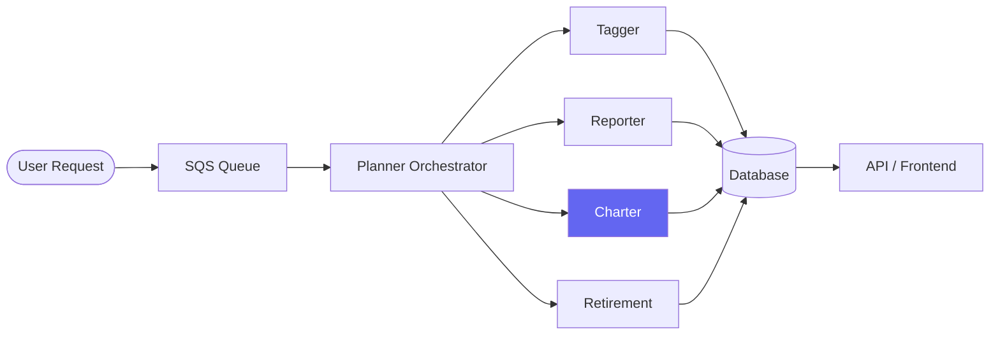
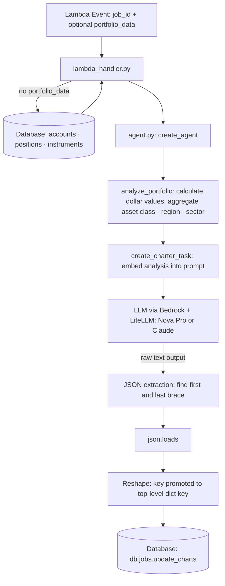
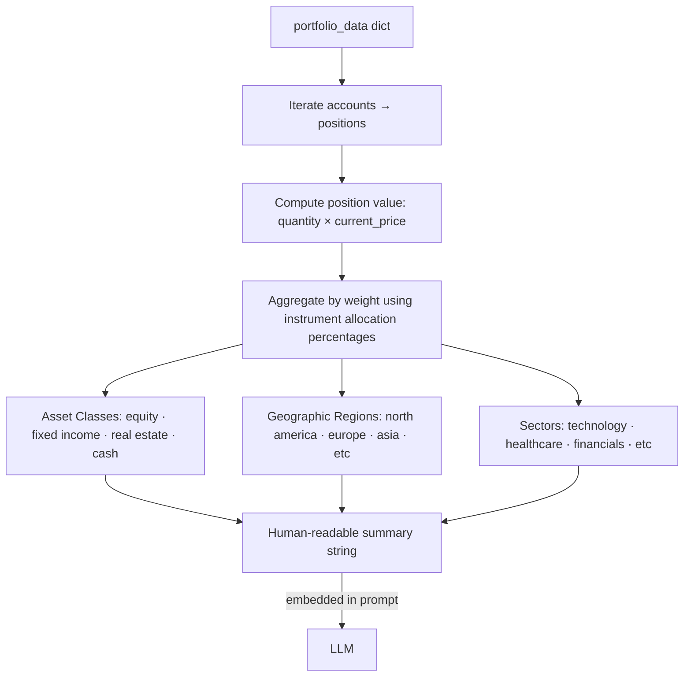
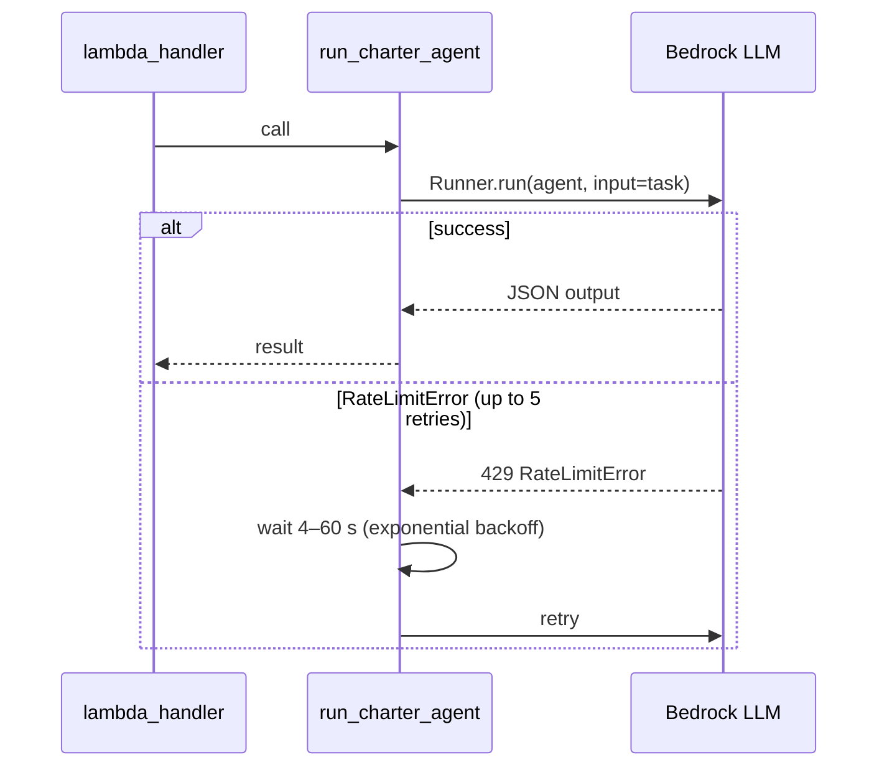
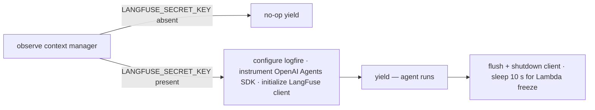
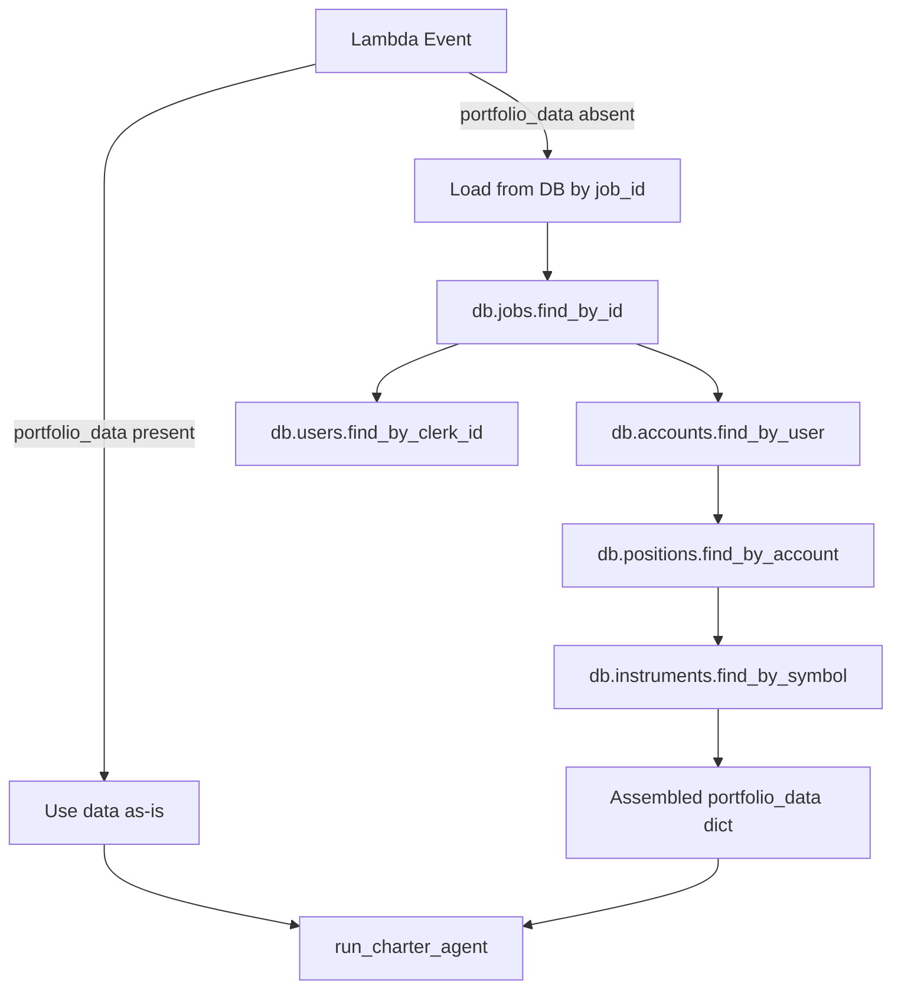

# Charter Agent Explainer

The Charter agent is a **visualization agent** — its sole job is to take a user's investment portfolio and produce 4–6 chart definitions as JSON, which the frontend renders. It runs as an AWS Lambda in the multi-agent pipeline, typically after the Reporter and other agents have processed a job.

---

## What it does

1. Receives a `job_id` (and optionally pre-built `portfolio_data`) from the Planner
2. Pre-computes portfolio dollar values and allocation breakdowns in Python
3. Passes a compact analysis summary to an LLM
4. Parses the LLM's JSON output into chart definitions
5. Saves the charts to the database under the job record

---

## Architecture: tool-free, one-shot JSON generation

Unlike the Reporter (which uses tools and a context object), Charter is intentionally minimal:

- **No tools** — the agent does not call any functions or external APIs
- **No context object** — no `RunContextWrapper` needed
- **One-shot** — the model is expected to return valid JSON in a single turn (`max_turns=5`, practically one turn)
- **No Structured Outputs** — schema is enforced entirely via the system prompt, per the project constraint that LiteLLM+Bedrock cannot mix Structured Outputs and tool calling in the same agent

---

## Pipeline position



---

## Data flow



---

## Key files

| File | Role |
|---|---|
| `lambda_handler.py` | Lambda entry point — orchestrates the full flow, DB read/write |
| `agent.py` | Portfolio math (`analyze_portfolio`) + agent/model/task creation |
| `templates.py` | System prompt (`CHARTER_INSTRUCTIONS`) + task builder |
| `observability.py` | Optional LangFuse tracing via `logfire` |
| `pyproject.toml` | Dependencies: `openai-agents[litellm]`, `tenacity`, `langfuse`, etc. |

---

## `analyze_portfolio()` — pre-processing (`agent.py:16`)

Before the LLM runs, this function does the heavy lifting in Python so the prompt stays compact:



The resulting summary (dollar amounts, not raw JSON) is what gets sent to the model. The raw nested portfolio structure is intentionally excluded to keep context size down.

---

## Output schema

The LLM must return this exact shape (enforced by the system prompt with a worked example):

```json
{
  "charts": [
    {
      "key": "asset_allocation",
      "title": "Asset Class Distribution",
      "type": "pie",
      "description": "Portfolio allocation across major asset classes",
      "data": [
        { "name": "Equities", "value": 65900.50, "color": "#3B82F6" },
        { "name": "Bonds",    "value": 14100.25, "color": "#10B981" }
      ]
    }
  ]
}
```

Supported chart types: `pie`, `bar`, `donut`, `horizontalBar`.  
Values are **dollar amounts** — the frontend (Recharts) calculates percentages from them.

After parsing, the handler reshapes the array so each chart's `key` becomes the top-level dict key saved to the DB:

```
[{ "key": "asset_allocation", ... }]
          ↓
{ "asset_allocation": { "title": ..., "data": [...] } }
```

---

## JSON extraction strategy

The handler does not require a clean raw JSON response. It finds the first `{` and last `}` in the output, then calls `json.loads` on that substring. This guards against models that prepend or append prose despite the system prompt's instructions.

```python
start_idx = output.find('{')
end_idx   = output.rfind('}')
json_str  = output[start_idx:end_idx + 1]
```

---

## Retry logic

`run_charter_agent` is wrapped with `tenacity`:

- Retries up to **5 times** on `RateLimitError` only
- Exponential backoff: 4 s minimum, 60 s maximum



---

## Observability

`observability.py` provides an optional LangFuse trace via `logfire`. The `observe()` context manager wraps the entire Lambda handler.



The 10-second sleep is intentional — it gives in-flight HTTP requests time to complete before Lambda freezes the process.

---

## Portfolio data sourcing

Charter can receive `portfolio_data` two ways, making it callable standalone for testing:



---

## Notable design decisions

- **Pre-computed analysis over raw data in the prompt** — `analyze_portfolio()` runs in Python before the LLM call, reducing token usage and giving the model clean numbers rather than a deeply nested JSON blob.
- **Lenient JSON extraction** — brace-scanning instead of requiring a clean raw response; defensive against model verbosity without being fragile.
- **`max_turns=5`** is a safety ceiling. One turn is expected and the prompt is engineered for it.
- **Default model** (`BEDROCK_MODEL_ID` env var) ships as Claude 3.7 Sonnet in code but the project convention prefers Nova Pro to avoid rate limits. The env var is overridden at deploy time via Terraform.
