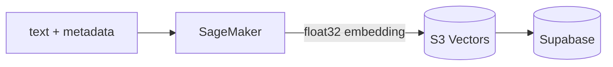
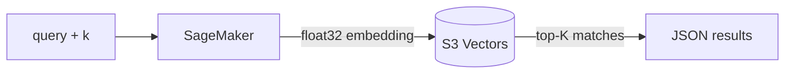
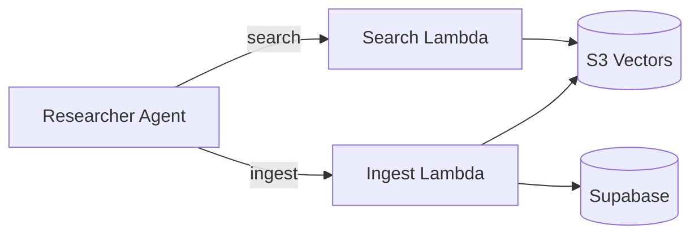
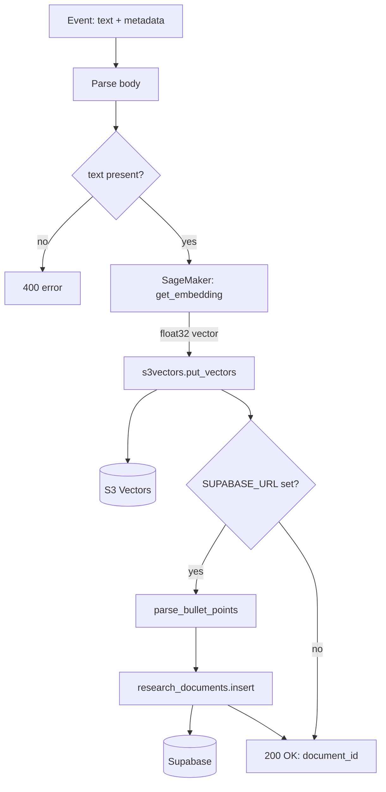
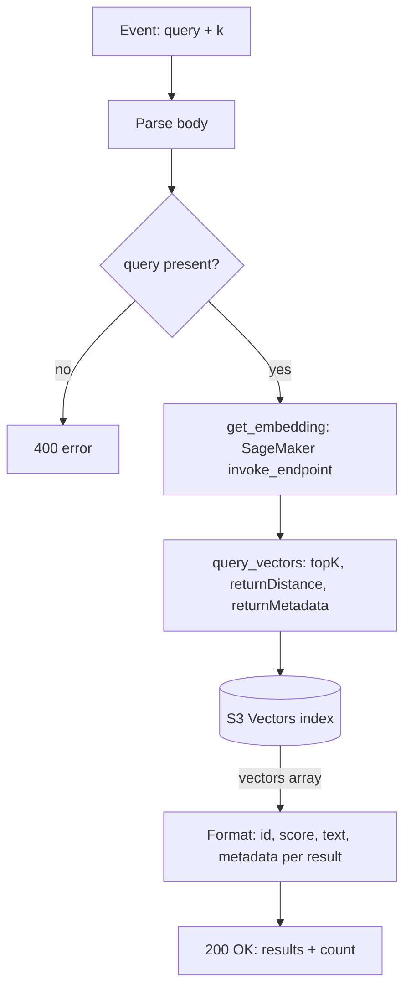
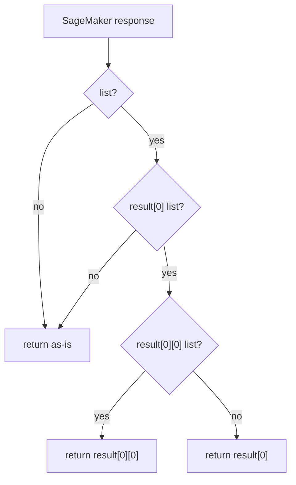
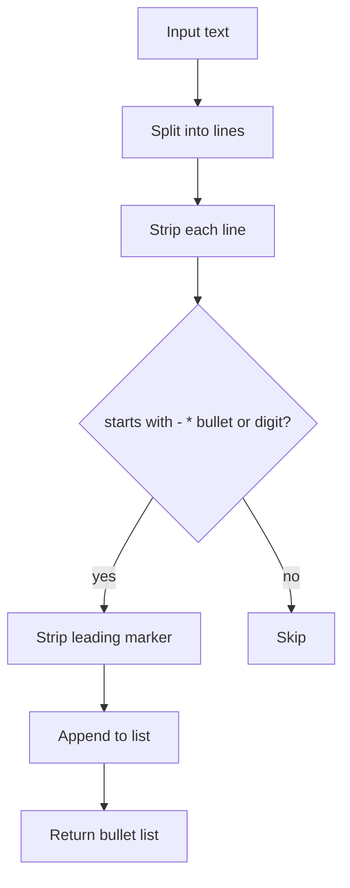
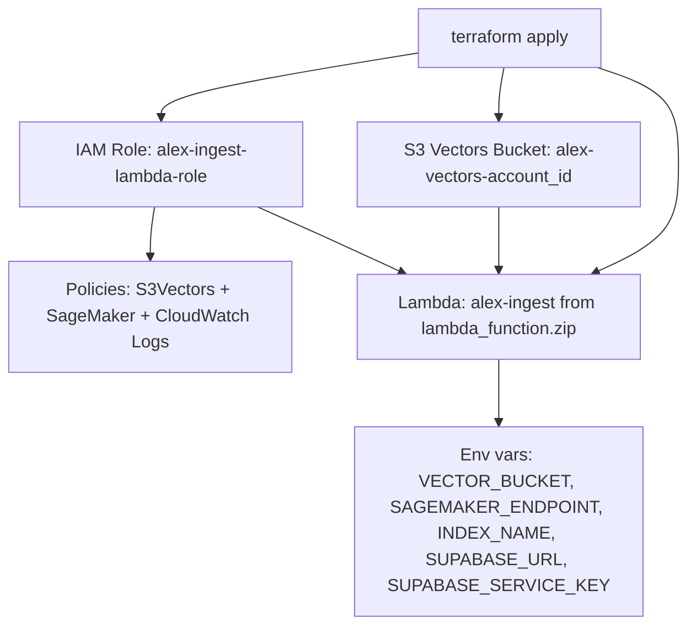

# Ingest Agent Explainer

The Ingest agent is a **document ingestion and vector search pipeline** — its job is to convert raw text (financial research, company descriptions, etc.) into embeddings stored in S3 Vectors, and to expose a semantic search interface over that knowledge base. It runs as two separate AWS Lambda functions: one for ingesting documents and one for querying them.

---

## What it does

### Ingest path (`ingest_s3vectors.py`)

1. Receives a JSON payload with `text` and optional `metadata`
2. Calls a SageMaker endpoint to produce a float32 embedding vector
3. Stores the vector + metadata in an S3 Vectors index (`financial-research`)
4. Optionally writes a structured record (with parsed bullet points) to Supabase

### Search path (`search_s3vectors.py`)

1. Receives a `query` string and optional `k` (number of results)
2. Embeds the query via the same SageMaker endpoint
3. Runs a top-K nearest-neighbour query against the S3 Vectors index
4. Returns matching documents with similarity scores and metadata

---

## Architecture overview

### Ingest Lambda

### Search Lambda

---

## Pipeline position

The ingest pipeline is upstream of the research agents — it pre-populates the vector knowledge base that the Researcher agent queries at runtime.

---

## Ingest data flow

---

## Search data flow

---

## Embedding extraction

The SageMaker HuggingFace endpoint returns a deeply nested array. The extraction logic handles all three shapes:

This guards against HuggingFace returning `[[[vec]]]`, `[[vec]]`, or `[vec]` depending on the model or batching configuration.

---

## Key files

| File                       | Role                                                                                     |
| -------------------------- | ---------------------------------------------------------------------------------------- |
| `ingest_s3vectors.py`      | Lambda handler for document ingestion — embeds, stores in S3 Vectors, writes to Supabase |
| `search_s3vectors.py`      | Lambda handler for semantic search — embeds query, runs top-K vector query               |
| `cleanup_s3vectors.py`     | Utility script to bulk-delete all vectors and Supabase rows (dev/test cleanup)           |
| `test_ingest_s3vectors.py` | Direct ingest test — bypasses API Gateway, ingests sample company docs                   |
| `test_search_s3vectors.py` | Direct search test — lists vectors and runs example semantic queries                     |
| `pyproject.toml`           | Dependencies: `boto3`, `supabase`, `python-dotenv`, `tenacity`                           |

---

## Supabase schema

When `SUPABASE_URL` and `SUPABASE_SERVICE_KEY` are set, each ingested document also writes a structured row to `research_documents`:

| Column          | Source                                                  |
| --------------- | ------------------------------------------------------- |
| `vector_id`     | UUID generated at ingest time (links to S3 Vectors key) |
| `topic`         | `metadata.topic` from the request                       |
| `full_text`     | The raw text input                                      |
| `bullet_points` | Extracted list items via `parse_bullet_points`          |
| `researched_at` | `metadata.timestamp` from the request                   |

### `parse_bullet_points` logic

Extracts any line whose first character is `-`, `•`, or `*`, or that starts with a digit followed by `.` or `)`:

---

## Infrastructure (Terraform `3_ingestion/`)

The S3 bucket uses AES256 server-side encryption with versioning enabled and all public access blocked.

---

## Environment variables

| Variable               | Default              | Purpose                                        |
| ---------------------- | -------------------- | ---------------------------------------------- |
| `VECTOR_BUCKET`        | `alex-vectors`       | S3 Vectors bucket name                         |
| `SAGEMAKER_ENDPOINT`   | _(required)_         | Embedding model endpoint name                  |
| `INDEX_NAME`           | `financial-research` | S3 Vectors index name                          |
| `SUPABASE_URL`         | _(optional)_         | Supabase project URL; skips DB write if absent |
| `SUPABASE_SERVICE_KEY` | _(optional)_         | Supabase service role key                      |

---

## Notable design decisions

- **S3 Vectors as the vector store** — AWS's native vector store (as of 2025) avoids managing a separate OpenSearch or Pinecone instance. The index is co-located with the S3 bucket.
- **Dual-write pattern** — vectors go to S3 Vectors for semantic search; structured rows go to Supabase for relational queries and audit. The `vector_id` UUID is the join key.
- **Stateless embedding extraction** — `get_embedding` is duplicated across both Lambda files intentionally; each Lambda is self-contained with no shared internal library dependency.
- **No list API** — S3 Vectors has no native list-all operation. The cleanup script works around this by querying with a generic embedding and batching deletes up to the `topK=30` limit per round trip.
- **Immediate consistency** — unlike OpenSearch, S3 Vectors updates are available for search immediately after `put_vectors` returns.
