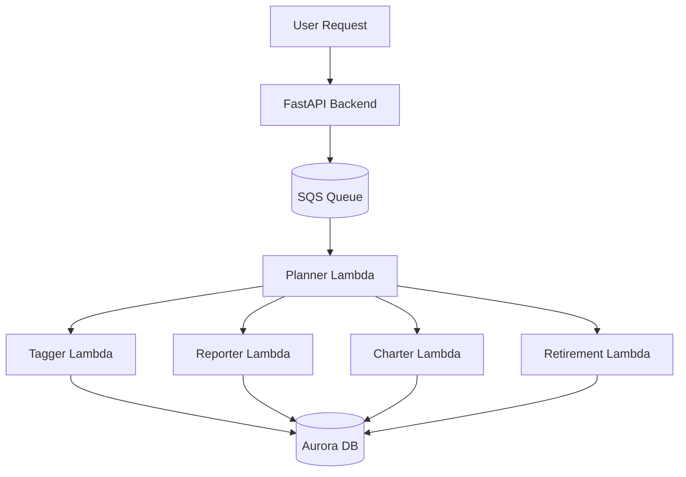
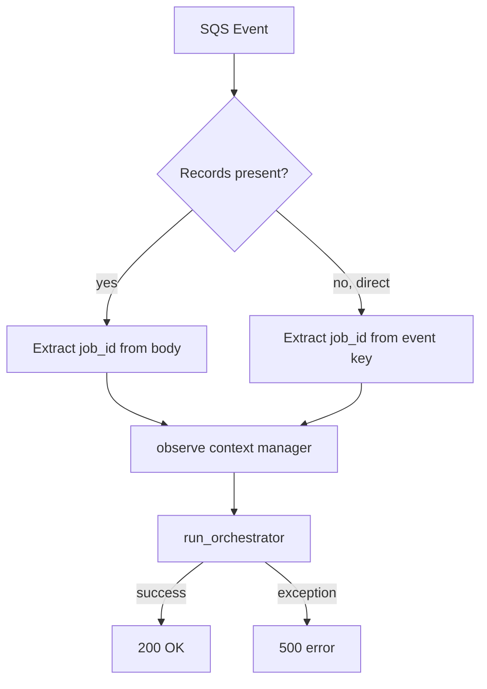
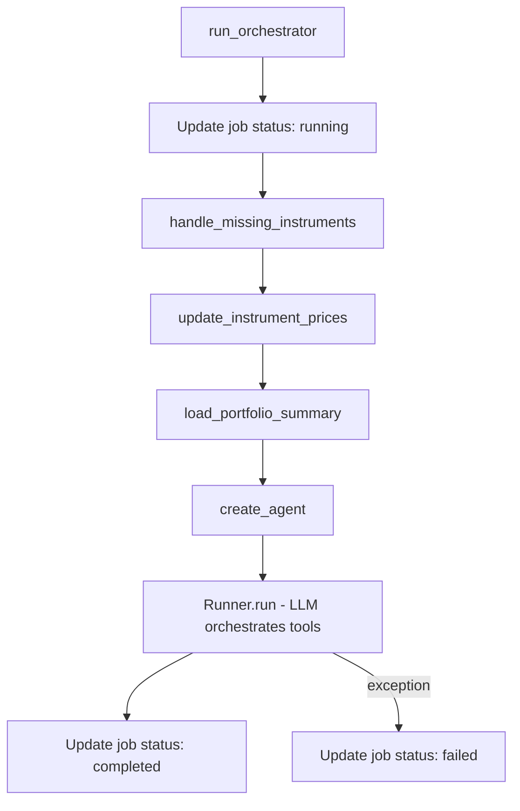
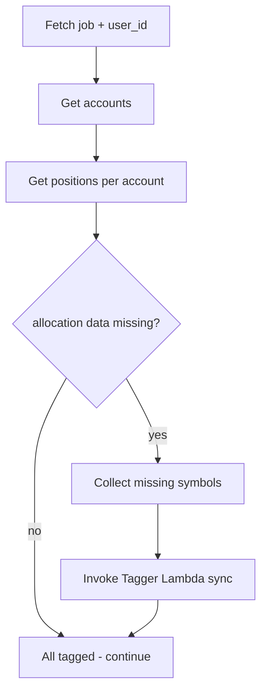
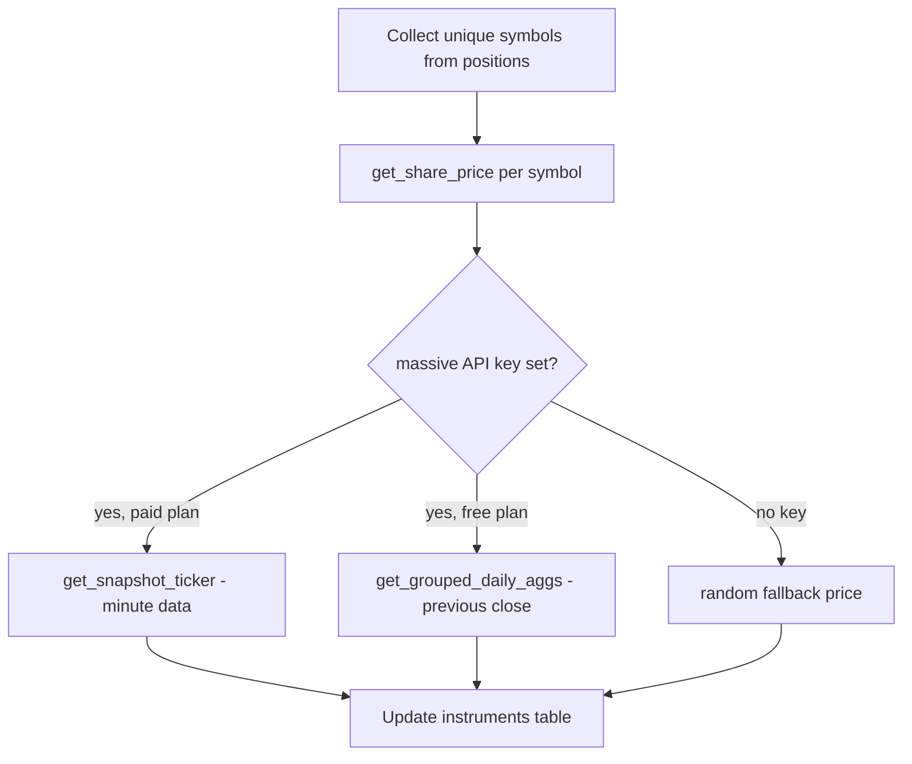
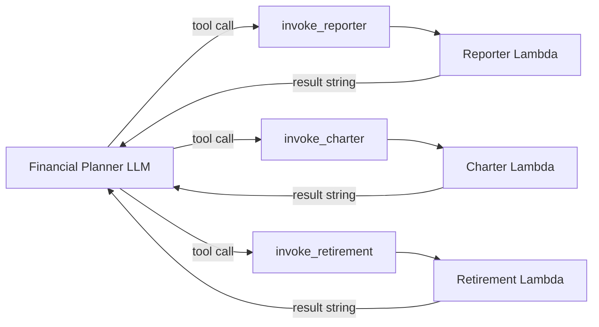
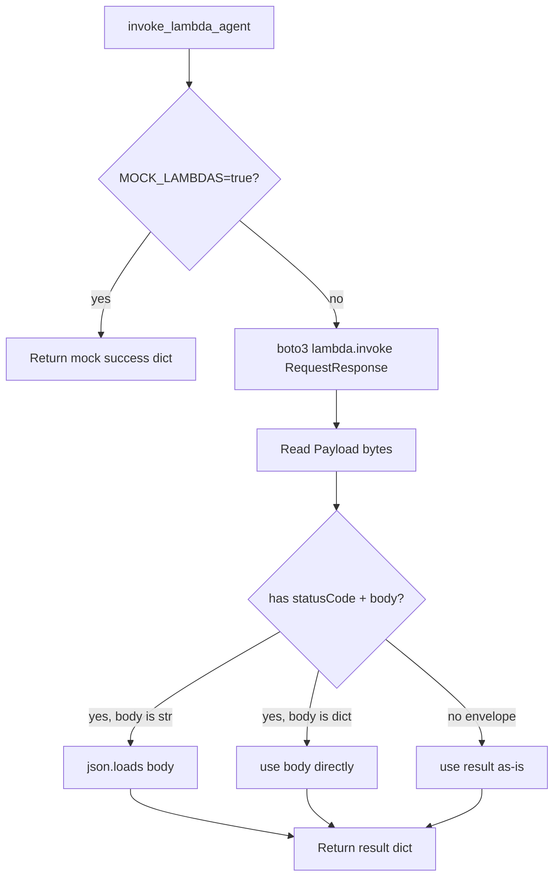
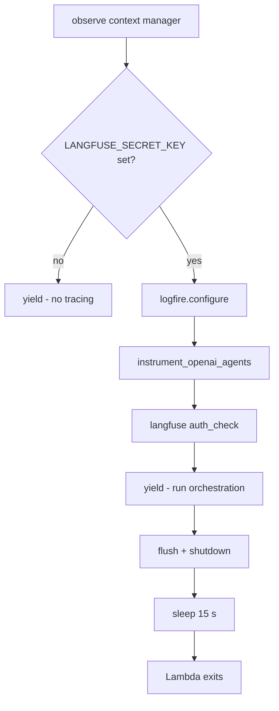

# Planner Agent Explainer

The Planner is the **orchestrator** for Alex's multi-agent portfolio analysis pipeline. It sits at the top of the agent hierarchy: when a user requests an analysis, the Planner wakes up, prepares the portfolio data, then coordinates three specialist agents (Reporter, Charter, Retirement) by invoking them as AWS Lambda functions in sequence.

---

## What it does

1. Receives a `job_id` from an SQS queue (or direct Lambda invocation)
2. Tags any unclassified portfolio instruments via the Tagger Lambda
3. Refreshes current market prices via massive.com
4. Runs the orchestrator agent (LLM on Bedrock) which decides which downstream agents to call
5. Updates the job status in Aurora (running → completed or failed)

---

## System position



---

## Lambda entry point

The `lambda_handler` in [lambda_handler.py](../../backend/planner/lambda_handler.py) is triggered by SQS. It parses the `job_id` from the SQS record body, wraps the entire run in an observability context, then calls `run_orchestrator`.



Two invocation modes are supported:

| Mode   | Trigger               | `job_id` source               |
| ------ | --------------------- | ----------------------------- |
| SQS    | Queue message         | `event['Records'][0]['body']` |
| Direct | Lambda console / test | `event['job_id']`             |

---

## Orchestration flow

`run_orchestrator` in [lambda_handler.py](../../backend/planner/lambda_handler.py) runs three sequential preparation steps before handing off to the LLM agent:



---

## Pre-processing: instrument tagging

[agent.py `handle_missing_instruments`](../../backend/planner/agent.py#L74) scans the user's portfolio for any instrument that is missing sector, region, or asset class allocation data, then invokes the Tagger Lambda synchronously to fill in those gaps before analysis begins.



This is a direct `boto3` `invoke` call (not an agent tool), so it always happens before the LLM runs.

---

## Pre-processing: price refresh

[market.py `update_instrument_prices`](../../backend/planner/market.py) fetches current prices for every symbol in the user's portfolio using the massive.com API, then writes updated prices back to the `instruments` table in Aurora.



Price fetching is non-critical: errors are logged and skipped so the pipeline continues even if massive.com is unavailable.

---

## Agent tools

The LLM agent in [agent.py](../../backend/planner/agent.py) has exactly three `@function_tool` callables. Each wraps an async Lambda invocation and returns a status string to the model.

| Tool                | Lambda            | Purpose                               |
| ------------------- | ----------------- | ------------------------------------- |
| `invoke_reporter`   | `alex-reporter`   | Generate portfolio analysis narrative |
| `invoke_charter`    | `alex-charter`    | Create portfolio visualisation charts |
| `invoke_retirement` | `alex-retirement` | Calculate retirement projections      |



All three tools read the `job_id` from `PlannerContext` (injected via `RunContextWrapper`) — the LLM never needs to pass it explicitly.

---

## Orchestrator instructions

The system prompt in [templates.py](../../backend/planner/templates.py) is deliberately minimal:

```
1. Call invoke_reporter if positions > 0
2. Call invoke_charter if positions >= 2
3. Call invoke_retirement if retirement goals exist
4. Respond with "Done"
```

The model receives a brief task string with position count and years-to-retirement so it can apply those conditions. This keeps the context small and prevents the LLM from improvising beyond the three defined tools.

---

## Lambda invocation pattern

`invoke_lambda_agent` in [agent.py](../../backend/planner/agent.py#L35) handles both live and mock modes, and unwraps the standard Lambda response envelope:



`MOCK_LAMBDAS=true` short-circuits all Lambda calls for local testing without any AWS credentials or deployed infrastructure.

---

## Rate limiting and retries

`run_orchestrator` is wrapped with `tenacity` retry logic targeting `RateLimitError` from LiteLLM:

| Parameter    | Value       |
| ------------ | ----------- |
| Max attempts | 5           |
| Min wait     | 4 s         |
| Max wait     | 60 s        |
| Backoff      | Exponential |

Bedrock Nova Pro is the preferred model precisely to avoid the stricter rate limits on Claude Sonnet.

---

## Observability

[observability.py](../../backend/planner/observability.py) provides a `with observe():` context manager that wraps the entire Lambda execution. If `LANGFUSE_SECRET_KEY` is set:

1. `logfire.configure` sets up OpenTelemetry for the `alex_planner_agent` service
2. `logfire.instrument_openai_agents()` patches the OpenAI Agents SDK to emit spans
3. LangFuse receives those spans via the OTLP exporter
4. On exit, `langfuse_client.flush()` + a 15 s sleep ensures traces reach LangFuse before Lambda terminates

Without `LANGFUSE_SECRET_KEY`, the context manager is a no-op.



---

## Model configuration

The Planner uses Bedrock through LiteLLM:

```python
model = LitellmModel(model=f"bedrock/{model_id}")
```

`AWS_REGION_NAME` is set explicitly from `BEDROCK_REGION` before creating the model — LiteLLM requires this specific env var name (not `AWS_REGION` or `DEFAULT_AWS_REGION`).

| Env var               | Default                                        | Purpose                                  |
| --------------------- | ---------------------------------------------- | ---------------------------------------- |
| `BEDROCK_MODEL_ID`    | `us.anthropic.claude-3-7-sonnet-20250219-v1:0` | LLM for orchestration decisions          |
| `BEDROCK_REGION`      | `us-west-2`                                    | Written to `AWS_REGION_NAME` for LiteLLM |
| `TAGGER_FUNCTION`     | `alex-tagger`                                  | Tagger Lambda function name              |
| `REPORTER_FUNCTION`   | `alex-reporter`                                | Reporter Lambda function name            |
| `CHARTER_FUNCTION`    | `alex-charter`                                 | Charter Lambda function name             |
| `RETIREMENT_FUNCTION` | `alex-retirement`                              | Retirement Lambda function name          |
| `MOCK_LAMBDAS`        | `false`                                        | Skip real Lambda calls for local testing |
| `MASSIVE_API_KEY`     | _(optional)_                                   | massive.com key for live prices          |
| `MASSIVE_PLAN`        | _(optional)_                                   | Set to `paid` for minute-level data      |
| `LANGFUSE_SECRET_KEY` | _(optional)_                                   | Enables LangFuse tracing                 |

---

## Key files

| File                                                         | Role                                                                        |
| ------------------------------------------------------------ | --------------------------------------------------------------------------- |
| [lambda_handler.py](../../backend/planner/lambda_handler.py) | Lambda entry point, SQS parsing, retry wrapper, job status management       |
| [agent.py](../../backend/planner/agent.py)                   | Agent creation, tool definitions, Lambda invocation, pre-processing helpers |
| [templates.py](../../backend/planner/templates.py)           | Orchestrator system prompt                                                  |
| [market.py](../../backend/planner/market.py)                 | Price refresh via massive.com                                               |
| [prices.py](../../backend/planner/prices.py)                 | massive.com REST client wrappers (EOD and minute-level)                     |
| [observability.py](../../backend/planner/observability.py)   | LangFuse tracing context manager                                            |
| [test_simple.py](../../backend/planner/test_simple.py)       | Local test with `MOCK_LAMBDAS=true`                                         |
| [test_full.py](../../backend/planner/test_full.py)           | End-to-end test against deployed AWS resources                              |

---

## Notable design decisions

- **Orchestrator-only LLM** — The Planner LLM makes no analytical decisions; it only decides _which_ of the three tools to call based on simple conditions (position count, retirement data). All analysis is delegated to specialist agents.
- **Pre-processing outside the LLM** — Tagging and price refresh happen as plain Python before the agent runs, keeping the tool surface minimal and avoiding non-determinism in data preparation.
- **Context passed via `PlannerContext`** — Tools receive `job_id` from `RunContextWrapper`, not from LLM-generated arguments. This prevents the model from hallucinating or corrupting the job identifier.
- **`MOCK_LAMBDAS` flag** — Allows full local testing of the orchestration logic without any AWS infrastructure. Set `MOCK_LAMBDAS=true` and all downstream Lambda calls return a canned success response.
- **Structured Outputs vs Tool Calling** — The Planner uses tool calling. Per the LiteLLM+Bedrock limitation documented in `CLAUDE.md`, an agent cannot use both Structured Outputs and Tool Calling simultaneously — the Planner opts for tools since it must invoke sub-agents.
