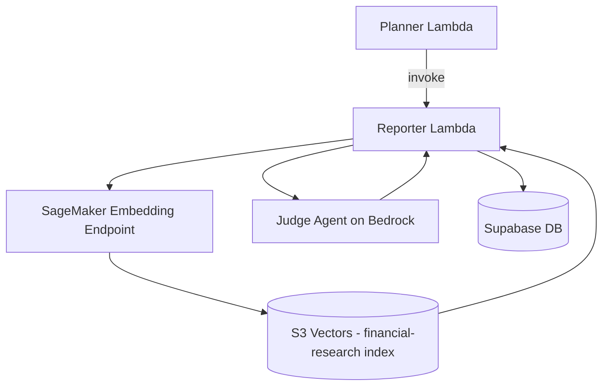
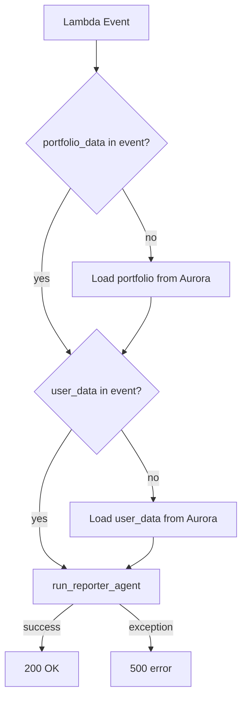
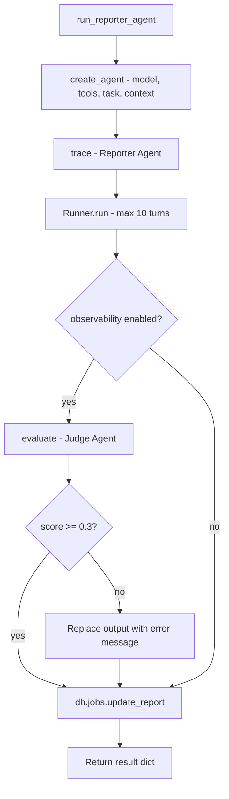
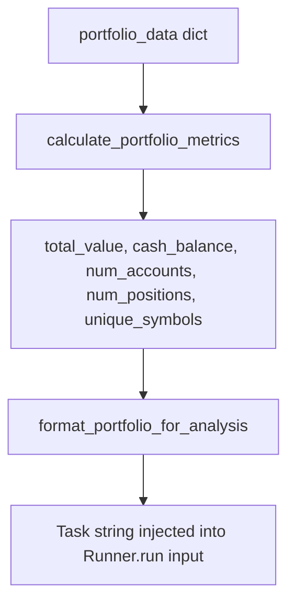
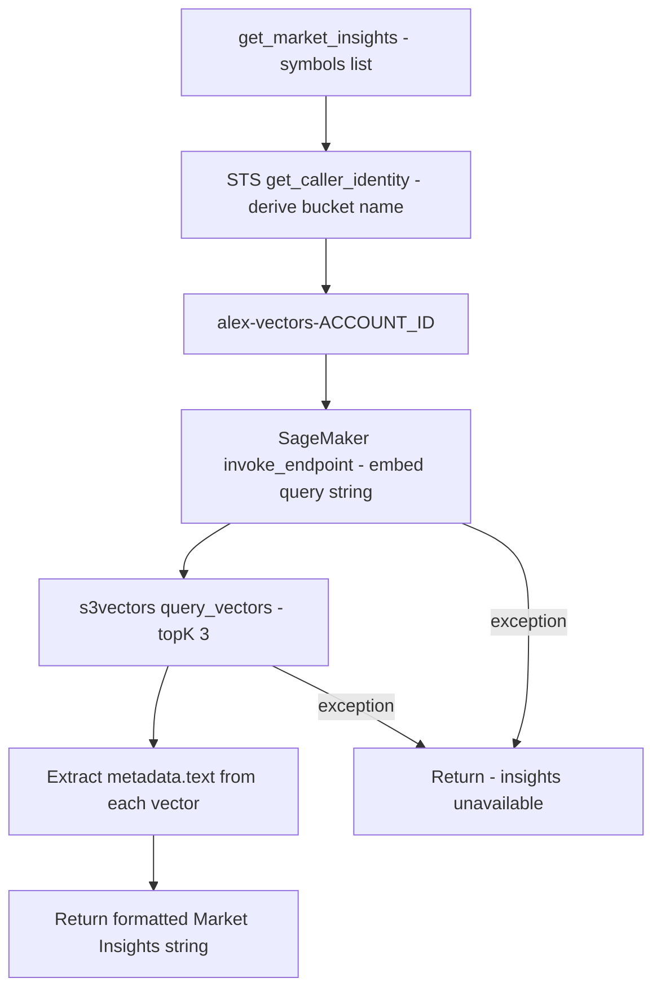
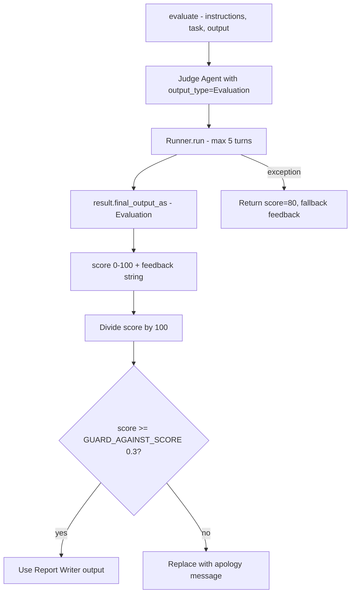
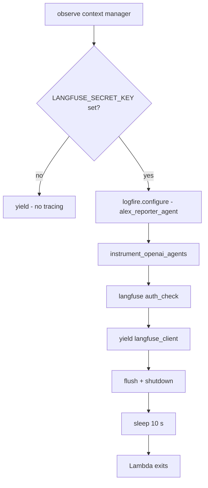

# Reporter Agent Explainer

The Reporter is a **specialist analyst agent** invoked by the Planner. Its job is to read the user's portfolio, pull in relevant market context from a vector knowledge base, write a comprehensive markdown analysis report, evaluate that report with an LLM judge, and persist the result to Aurora.

---

## What it does

1. Receives `job_id`, `portfolio_data`, and `user_data` from the Planner Lambda (or loads them from Aurora if not provided)
2. Formats the portfolio into a structured summary for the LLM
3. Runs the Report Writer agent, which calls `get_market_insights` to retrieve vector-search context from S3 Vectors
4. Scores the report with a Judge agent (LLM-as-judge)
5. Guards against poor quality output — if score < 0.3 the report is replaced with an error message
6. Saves the final report to Aurora via `db.jobs.update_report`

---

## System position

---

## Lambda entry point

The `lambda_handler` in [lambda_handler.py](../../backend/reporter/lambda_handler.py) accepts a direct Lambda invocation (not SQS). The entire execution is wrapped in `observe()` for LangFuse tracing.

The data-loading fallback means the Planner can invoke the Reporter with just a `job_id` and the Reporter will self-populate `portfolio_data` and `user_data` from Aurora — useful when payload size would exceed Lambda limits.

---

## Agent execution flow

`run_reporter_agent` in [lambda_handler.py](../../backend/reporter/lambda_handler.py) creates the agent, runs it, judges the output, then persists the report:

---

## Portfolio formatting

Before the agent runs, [agent.py `format_portfolio_for_analysis`](../../backend/reporter/agent.py#L61) converts the raw portfolio dict into a plain-text summary. `calculate_portfolio_metrics` computes totals that go into the header:

The formatted output includes account-level cash balances, per-position share counts, asset class tags, regional allocations, and the user's retirement profile (years to retirement, target income). The LLM never receives the raw JSON — only this formatted string.

---

## Tool: get_market_insights

The agent has exactly one tool. `get_market_insights` in [agent.py](../../backend/reporter/agent.py#L125) performs a two-step retrieval against the vector knowledge base:

The query string is formed as `"market analysis SYMBOL1 SYMBOL2 ..."` (up to 5 symbols). The S3 Vectors index is named `financial-research`. Each returned vector contributes up to 200 characters of text prefixed with the company name.

The tool receives `job_id` and database connection through `RunContextWrapper[ReporterContext]` — the LLM only passes the `symbols` list, never any identity data.

---

## ReporterContext

[agent.py](../../backend/reporter/agent.py#L17) defines a typed context dataclass that is created once per invocation and injected into the Runner:

| Field            | Type            | Purpose                                      |
| ---------------- | --------------- | -------------------------------------------- |
| `job_id`         | `str`           | Identifies the job for DB writes and tracing |
| `portfolio_data` | `dict`          | Full portfolio passed through to tools       |
| `user_data`      | `dict`          | Retirement goals (years, target income)      |
| `db`             | `Optional[Any]` | Live database connection; `None` in tests    |

Tools receive this via `wrapper: RunContextWrapper[ReporterContext]` — the LLM cannot read or mutate these fields.

---

## Judge agent

[judge.py](../../backend/reporter/judge.py) runs a second LLM call after the Report Writer finishes. It uses Structured Outputs (not tool calling) to produce an `Evaluation` object:

The Judge agent uses the same Bedrock model as the Reporter. On any exception it returns a safe default score of 80 so a transient judge failure does not discard a valid report.

---

## Rate limiting and retries

`run_reporter_agent` is decorated with `tenacity` to handle Bedrock rate limit responses from LiteLLM:

| Parameter    | Value            |
| ------------ | ---------------- |
| Retry on     | `RateLimitError` |
| Max attempts | 5                |
| Min wait     | 4 s              |
| Max wait     | 60 s             |
| Backoff      | Exponential      |

---

## Observability

[observability.py](../../backend/reporter/observability.py) provides the same `with observe():` context manager as the Planner. If `LANGFUSE_SECRET_KEY` is set:

1. `logfire.configure` sets up OpenTelemetry for the `alex_reporter_agent` service
2. `logfire.instrument_openai_agents()` patches the OpenAI Agents SDK to emit spans
3. The Judge score and feedback are attached as a `NUMERIC` span score named `Judge`
4. On exit, `langfuse_client.flush()` + a 10 s sleep drains traces before Lambda terminates

---

## System prompt

[templates.py `REPORTER_INSTRUCTIONS`](../../backend/reporter/templates.py) gives the agent a fixed seven-section report structure:

1. Executive Summary (3–4 key points)
2. Portfolio Composition Analysis
3. Diversification Assessment
4. Risk Profile Evaluation
5. Retirement Readiness
6. Specific Recommendations (5–7 actionable items)
7. Conclusion

The instructions also specify tone (professional, accessible to retail investors), formatting (markdown with headers, bullets, emphasis), and emphasis on actionable, prioritized recommendations.

---

## Model configuration

| Env var               | Default                   | Purpose                                         |
| --------------------- | ------------------------- | ----------------------------------------------- |
| `BEDROCK_MODEL_ID`    | `us.amazon.nova-pro-v1:0` | LLM for report writing and judging              |
| `BEDROCK_REGION`      | `us-west-2`               | Written to `AWS_REGION_NAME` for LiteLLM        |
| `DEFAULT_AWS_REGION`  | `us-west-2`               | Region for SageMaker and S3 Vectors clients     |
| `SAGEMAKER_ENDPOINT`  | `alex-embedding-endpoint` | Embedding endpoint for market insight retrieval |
| `LANGFUSE_SECRET_KEY` | _(optional)_              | Enables LangFuse tracing                        |

`AWS_REGION_NAME` is set explicitly from `BEDROCK_REGION` before the `LitellmModel` is constructed — LiteLLM requires this specific variable name, not `AWS_REGION` or `DEFAULT_AWS_REGION`.

---

## Key files

| File                                                          | Role                                                                                  |
| ------------------------------------------------------------- | ------------------------------------------------------------------------------------- |
| [lambda_handler.py](../../backend/reporter/lambda_handler.py) | Lambda entry point, data loading fallback, retry wrapper, judge guard, DB persistence |
| [agent.py](../../backend/reporter/agent.py)                   | Agent creation, `ReporterContext`, portfolio formatting, `get_market_insights` tool   |
| [templates.py](../../backend/reporter/templates.py)           | Report Writer system prompt and report structure                                      |
| [judge.py](../../backend/reporter/judge.py)                   | Judge agent with Structured Outputs, `Evaluation` schema                              |
| [observability.py](../../backend/reporter/observability.py)   | LangFuse tracing context manager                                                      |
| [test_simple.py](../../backend/reporter/test_simple.py)       | Local test without AWS infrastructure                                                 |
| [test_full.py](../../backend/reporter/test_full.py)           | End-to-end test against deployed resources                                            |

---

## Notable design decisions

- **Single tool, single responsibility** — The Reporter has exactly one tool (`get_market_insights`) and one output goal (a markdown report). This keeps the agent's context small and its behaviour predictable within `max_turns=10`.
- **LLM-as-judge with a hard floor** — The 0.3 guard score means a catastrophically bad report is never persisted. The fallback score of 80 on judge exceptions avoids penalising valid reports when the judge itself fails.
- **Structured Outputs for the judge, tool calling for the reporter** — Consistent with the LiteLLM+Bedrock limitation: each agent uses one or the other, not both. The Reporter needs `get_market_insights` so it uses tool calling; the Judge only needs a typed return value so it uses Structured Outputs.
- **Context via `RunContextWrapper`, not LLM arguments** — `job_id` and the database handle are injected at the SDK level. The LLM can only pass `symbols` to `get_market_insights`; it cannot forge or inspect the job identity.
- **Data-loading fallback in the handler** — The Reporter can be invoked with only a `job_id`. This decouples it from Planner payload size constraints and makes direct re-runs (e.g., from the Lambda console) straightforward.
