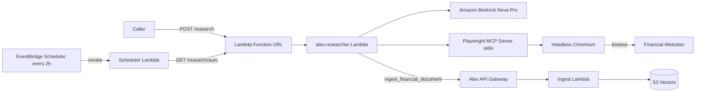
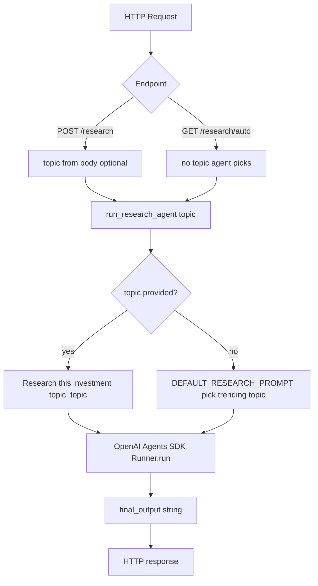
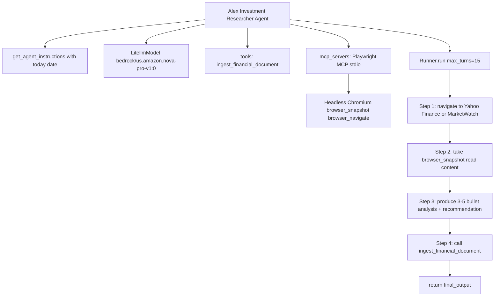
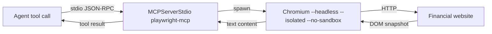
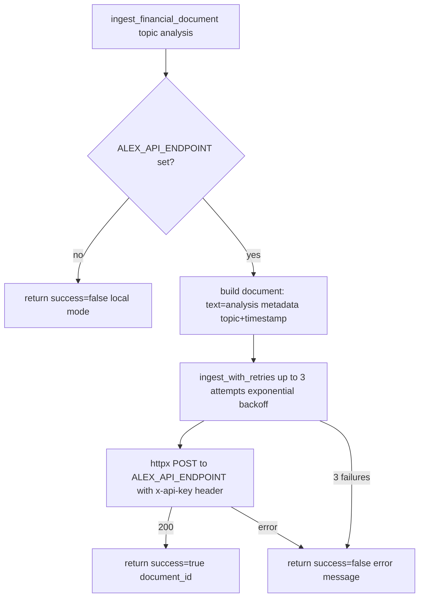
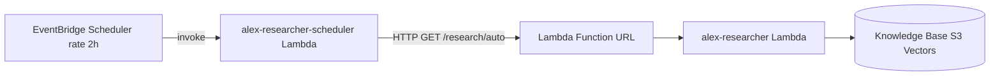
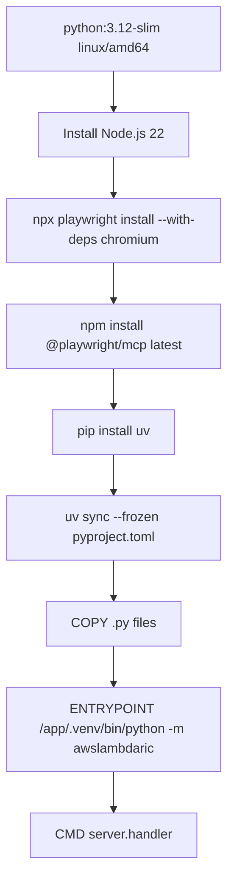
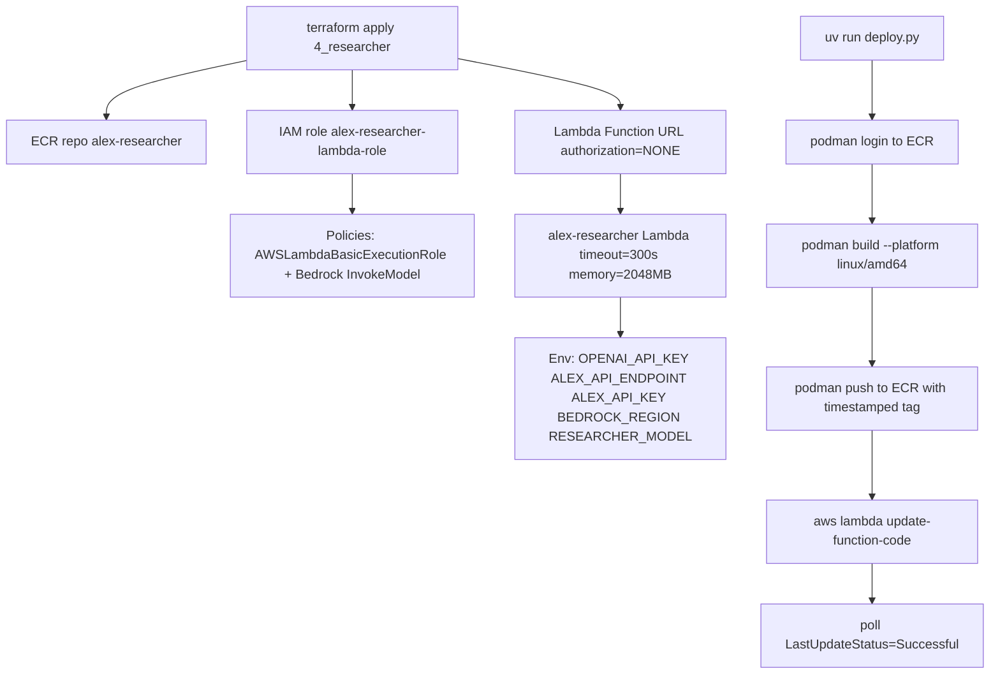

# Researcher Agent Explainer

The Researcher agent is an **autonomous investment research service** — its job is to browse live financial websites, synthesise a brief analysis, and persist the findings to the Alex knowledge base via the Ingest Lambda. It runs as a containerised AWS Lambda function exposed through a public Lambda Function URL, and is triggered either on demand (HTTP POST) or automatically every two hours by an EventBridge Scheduler.

---

## What it does

1. Receives a research topic (or picks a trending one autonomously)
2. Opens a headless Chromium browser via the Playwright MCP server
3. Visits up to two financial pages (Yahoo Finance, MarketWatch, etc.)
4. Produces a concise bullet-point analysis using Amazon Bedrock (Nova Pro)
5. Calls `ingest_financial_document` to store the analysis in the knowledge base

---

## Architecture overview

---

## Request flow

---

## Agent internals

---

## Playwright MCP server

The agent has no built-in web access. Instead, it communicates with a Playwright MCP server over stdio. The MCP server spawns a headless Chromium process and exposes browser tools (`browser_navigate`, `browser_snapshot`, etc.) as MCP tool calls.

**Container path resolution** — in production (Lambda), the binary is pre-installed at `/app/node_modules/.bin/playwright-mcp` and Chromium lives under `/root/.cache/ms-playwright/`. The `create_playwright_mcp_server` function detects the container environment and passes the explicit `--executable-path` to avoid relying on PATH resolution.

---

## `ingest_financial_document` tool

Once the agent has its analysis, it calls this function tool to persist it.

The retry wrapper uses `tenacity` with exponential back-off (1s → 10s) to handle SageMaker cold-start latency on the downstream Ingest Lambda.

---

## Automated scheduling

The Scheduler Lambda (`backend/scheduler/`) is a thin HTTP caller — it reads `APP_RUNNER_URL` from its environment and hits the `/research/auto` endpoint. EventBridge uses its own IAM role (`alex-eventbridge-scheduler-role`) with `lambda:InvokeFunction` permission scoped to the Scheduler Lambda ARN.

---

## Container image

The entry point bypasses `uv run` at invocation time — the venv Python is called directly so the Lambda runtime does not trigger uv filesystem writes under the read-only `/tmp` constraint.

---

## Deployment pipeline

---

## HTTP endpoints

| Method | Path             | Purpose                                                         |
| ------ | ---------------- | --------------------------------------------------------------- |
| GET    | `/`              | Health check — returns service name and UTC timestamp           |
| GET    | `/health`        | Detailed check — shows API config, region, model, container env |
| POST   | `/research`      | On-demand research; optional `topic` in JSON body               |
| GET    | `/research/auto` | Automated research; agent picks the topic; used by scheduler    |
| GET    | `/test-bedrock`  | Smoke test for Bedrock connectivity (dev/debug only)            |

---

## Key files

| File             | Role                                                                              |
| ---------------- | --------------------------------------------------------------------------------- |
| [server.py](backend/researcher/server.py)       | FastAPI app, Lambda entry point via Mangum, all HTTP endpoints      |
| [context.py](backend/researcher/context.py)      | Agent system prompt (`get_agent_instructions`) and default research prompt         |
| [tools.py](backend/researcher/tools.py)        | `ingest_financial_document` function tool with retry logic                        |
| [mcp_servers.py](backend/researcher/mcp_servers.py)  | `create_playwright_mcp_server` — configures stdio MCP for Playwright              |
| [deploy.py](backend/researcher/deploy.py)       | Deployment script: builds container, pushes to ECR, updates Lambda               |
| [Dockerfile](backend/researcher/Dockerfile)      | Multi-stage image: Node + Chromium + Playwright MCP + Python deps                |
| [pyproject.toml](backend/researcher/pyproject.toml)  | Dependencies: `openai-agents[litellm]`, `fastapi`, `playwright`, `tenacity`, etc. |

---

## Environment variables

| Variable            | Default                           | Purpose                                             |
| ------------------- | --------------------------------- | --------------------------------------------------- |
| `RESEARCHER_MODEL`  | `bedrock/us.amazon.nova-pro-v1:0` | Bedrock model ID passed to LitellmModel             |
| `BEDROCK_REGION`    | `us-west-2`                       | AWS region for Bedrock inference                    |
| `ALEX_API_ENDPOINT` | _(required for ingest)_           | URL of the Ingest Lambda API Gateway endpoint       |
| `ALEX_API_KEY`      | _(required for ingest)_           | API key sent as `x-api-key` to the Ingest endpoint  |
| `OPENAI_API_KEY`    | _(required by SDK)_               | Needed by `openai-agents` SDK even when using LiteLLM |
| `MCP_LOGGING`       | _(optional)_                      | Enable verbose MCP stdio logging for debugging      |

---

## Notable design decisions

- **Lambda over App Runner** — despite the name "researcher service", the agent runs as a Lambda function (not App Runner). Lambda's 300s timeout is sufficient for a 2-page browse + ingest cycle; Lambda avoids the cost of a permanently running App Runner instance.
- **Playwright via MCP** — web browsing is delegated entirely to the Playwright MCP server over stdio. The agent never calls browser APIs directly; it just makes tool calls. This keeps the agent code decoupled from browser internals.
- **Pre-baked binary path** — `@playwright/mcp` is installed at image build time into `/app/node_modules/.bin/` so the Lambda runtime never hits npm. This avoids network calls and filesystem permission issues inside the Lambda execution environment.
- **Direct venv Python as entrypoint** — `uv run` writes to the filesystem; inside Lambda's read-only environment this causes errors. Calling `/app/.venv/bin/python` directly sidesteps uv entirely.
- **Concise prompting by design** — the agent instructions cap browsing at two pages and analysis at 3–5 bullets. This keeps execution well within the 300s Lambda timeout and reduces LLM token cost per run.
- **Mangum bridge** — `Mangum(app)` wraps the FastAPI ASGI app so the same codebase can be invoked as a Lambda function or run locally with `uvicorn` without any code changes.
