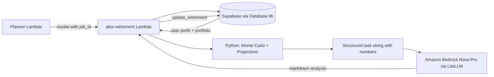
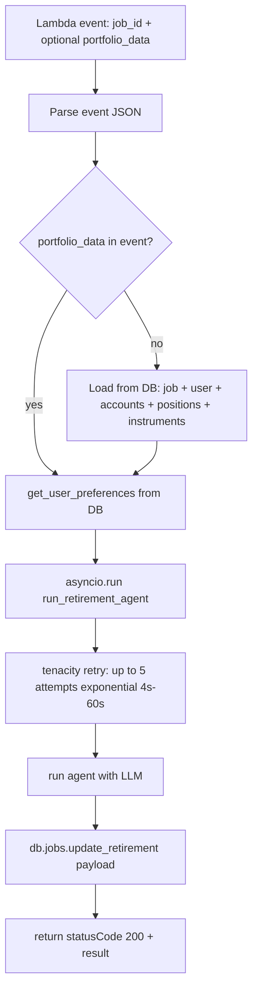
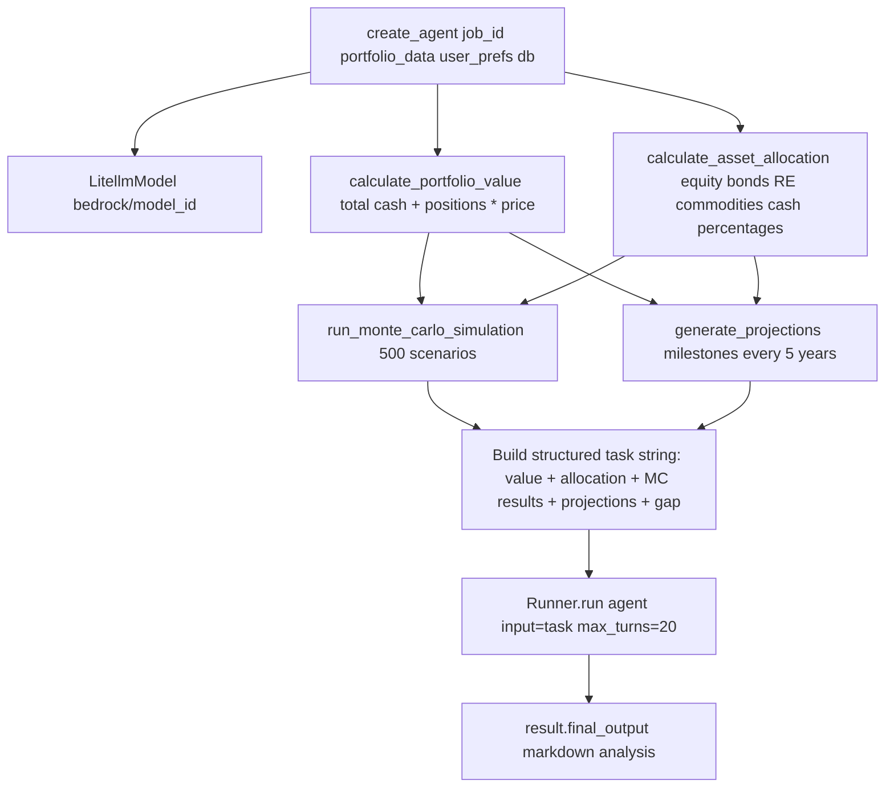
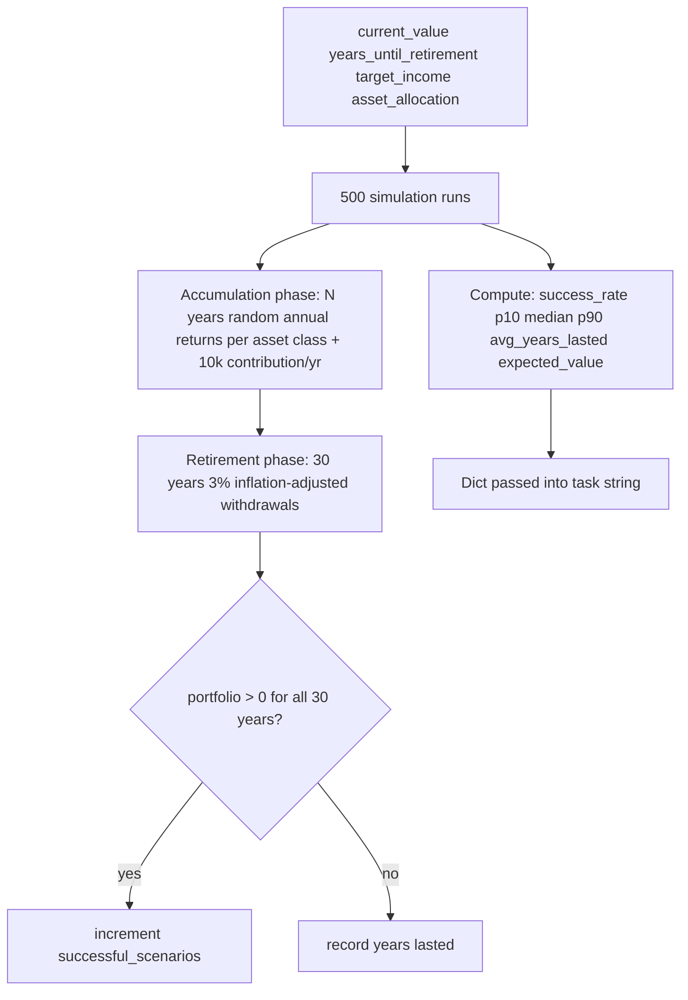
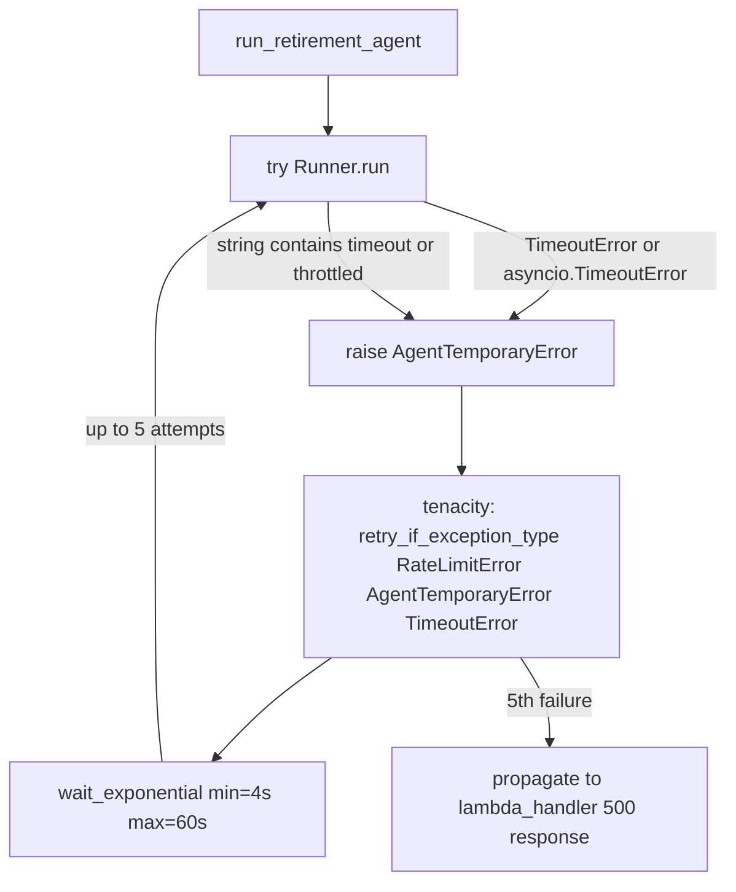
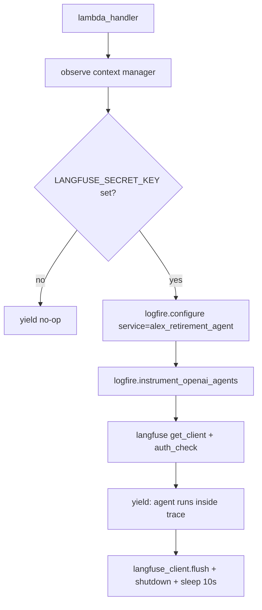

# Retirement Agent Explainer

The Retirement agent is a **retirement readiness analyser** — its job is to take a user's live portfolio, run quantitative projections and a Monte Carlo simulation entirely in Python (no external tools), then hand the pre-computed numbers to an LLM that synthesises a plain-English retirement assessment. It runs as a standard AWS Lambda function and is invoked by the Planner (orchestrator) agent as part of a multi-agent analysis job.

---

## What it does

1. Receives a `job_id` (and optionally pre-assembled `portfolio_data`) from the Planner
2. Loads user preferences (years to retirement, target income) from the database if not provided
3. Computes portfolio value, asset allocation, Monte Carlo simulation, and milestone projections in Python
4. Sends the computed numbers as a structured prompt to the LLM (Amazon Bedrock Nova Pro via LiteLLM)
5. Receives a markdown retirement analysis as the final output
6. Persists the analysis back to the database under the job record

---

## Architecture overview



---

## Invocation flow



**Portfolio assembly** — when `portfolio_data` is absent from the event, the handler queries the database in depth: it resolves the job → user → accounts → positions → instruments chain, building a rich nested structure that includes `current_price` and `allocation_asset_class` per instrument.

---

## Agent internals



The agent has **no tools** — it receives all numbers pre-computed in the task string and returns its full analysis as `final_output`. This sidesteps the LiteLLM+Bedrock limitation that prevents an agent from using both structured outputs and tool calling simultaneously.

---

## Monte Carlo simulation



**Return parameters used:**

| Asset class  | Mean annual return | Std deviation |
| ------------ | ------------------ | ------------- |
| Equity       | 7 %                | 18 %          |
| Bonds        | 4 %                | 5 %           |
| Real estate  | 6 %                | 12 %          |
| Cash         | 2 %                | —             |

Annual contributions of $10,000 are assumed during the accumulation phase. Inflation of 3% is applied each withdrawal year in retirement.

---

## Retry and resilience



`AgentTemporaryError` is a thin local exception class used solely to give `tenacity` a typed hook — it wraps timeout and throttling signals that come back from the Bedrock inference endpoint.

---

## Observability



The 10-second sleep after `flush()` is a deliberate workaround: Lambda terminates the process immediately after the handler returns, which can cut off in-flight HTTP trace exports to LangFuse before they complete.

Within the agent run itself, the OpenAI Agents SDK `trace("Retirement Agent")` context manager adds a named span visible in any connected tracing backend.

---

## Database interactions

| Operation | Method | When |
| --------- | ------ | ---- |
| Look up job by ID | `db.jobs.find_by_id` | On entry, to find `clerk_user_id` |
| Look up user by Clerk ID | `db.users.find_by_clerk_id` | Load `years_until_retirement`, `target_retirement_income` |
| List accounts for user | `db.accounts.find_by_user` | Build portfolio structure |
| List positions for account | `db.positions.find_by_account` | Enumerate holdings |
| Look up instrument | `db.instruments.find_by_symbol` | Get `current_price` and `allocation_asset_class` |
| Persist analysis | `db.jobs.update_retirement` | After LLM returns `final_output` |

---

## LLM prompt structure

The task string passed to the agent is assembled entirely in `create_agent` and follows this layout:

```
# Portfolio Analysis Context

## Current Situation
  Portfolio value, allocation %, years to retirement, target income, age

## Monte Carlo Simulation Results (500 scenarios)
  success_rate, expected_value_at_retirement, p10, median, p90, avg_years_lasted

## Key Projections (Milestones)
  Up to 6 rows: age, portfolio value, phase (accumulation / retirement), annual income

## Risk Factors to Consider
  Sequence of returns, inflation, healthcare, longevity, equity volatility

## Safe Withdrawal Rate Analysis
  4% rule income, target income, gap

Your task: [instructions for analysis + action items]
```

The LLM receives no tools and is expected to return a complete markdown analysis in `final_output`.

---

## Key files

| File | Role |
| ---- | ---- |
| [lambda_handler.py](backend/retirement/lambda_handler.py) | Lambda entry point; portfolio assembly, retry wrapper, DB persistence |
| [agent.py](backend/retirement/agent.py) | `create_agent`: portfolio maths, Monte Carlo, projections, task assembly |
| [templates.py](backend/retirement/templates.py) | `RETIREMENT_INSTRUCTIONS` system prompt for the LLM |
| [observability.py](backend/retirement/observability.py) | LangFuse + logfire context manager |
| [pyproject.toml](backend/retirement/pyproject.toml) | Dependencies: `openai-agents[litellm]`, `tenacity`, `boto3`, shared `src` DB lib |

---

## Environment variables

| Variable | Default | Purpose |
| -------- | ------- | ------- |
| `BEDROCK_MODEL_ID` | `us.anthropic.claude-3-7-sonnet-20250219-v1:0` | Bedrock model; override with Nova Pro ID in production |
| `BEDROCK_REGION` | `us-west-2` | AWS region; written to `AWS_REGION_NAME` for LiteLLM |
| `LANGFUSE_SECRET_KEY` | _(optional)_ | Enables LangFuse trace export |
| `OPENAI_API_KEY` | _(required by SDK)_ | Needed by `openai-agents` SDK even when using LiteLLM |

> **Note:** LiteLLM requires `AWS_REGION_NAME` specifically — not `AWS_REGION` or `DEFAULT_AWS_REGION`. `create_agent` sets this explicitly via `os.environ["AWS_REGION_NAME"] = bedrock_region`.

---

## Notable design decisions

- **No agent tools** — all quantitative work (portfolio valuation, asset allocation, Monte Carlo, projections) is done in Python before the agent runs. The LLM only interprets and explains the numbers. This avoids the LiteLLM+Bedrock constraint that prevents an agent from using structured outputs and tool calls simultaneously, and keeps the LLM turn count at 1.
- **Pre-assembled task string** — rather than asking the LLM to request data iteratively, the handler serialises the full context into a single structured prompt. This makes the agent deterministic in its turn usage and reduces latency.
- **`asyncio.run` inside a sync handler** — Lambda handlers are synchronous; `asyncio.run` creates a fresh event loop for each invocation, which is the standard pattern when using the async `Runner.run` API inside Lambda.
- **`AgentTemporaryError` wrapper** — `tenacity` requires a typed exception to match against. The thin wrapper class converts untyped timeout/throttle strings from Bedrock into a typed signal without coupling the retry logic to LiteLLM internals.
- **$10,000 annual contribution assumption** — hardcoded in the simulation. This is a simplification; the value is surfaced to the LLM in the task string so it can be called out in its recommendations.
