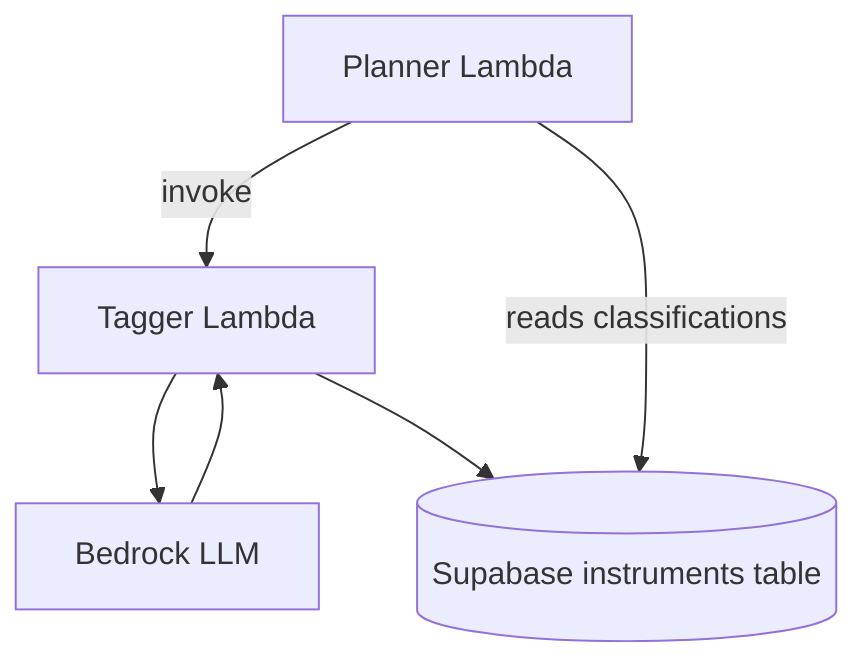
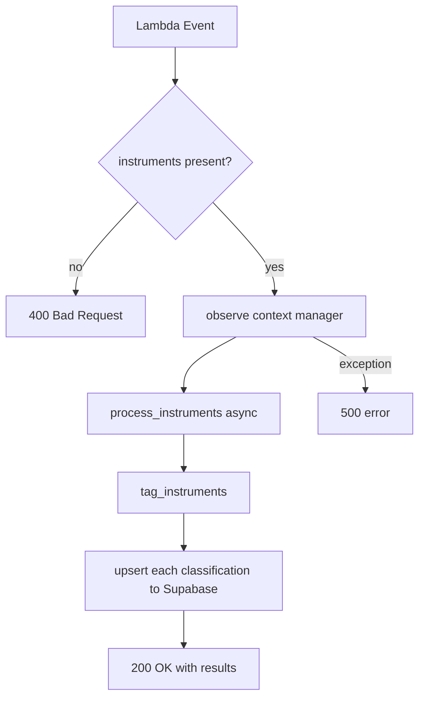
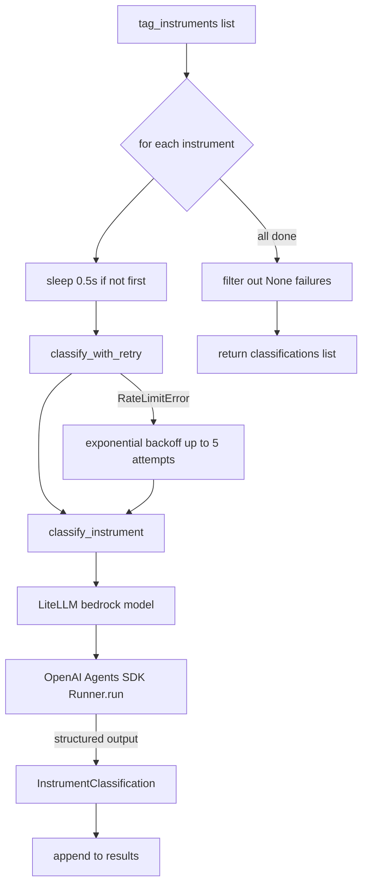
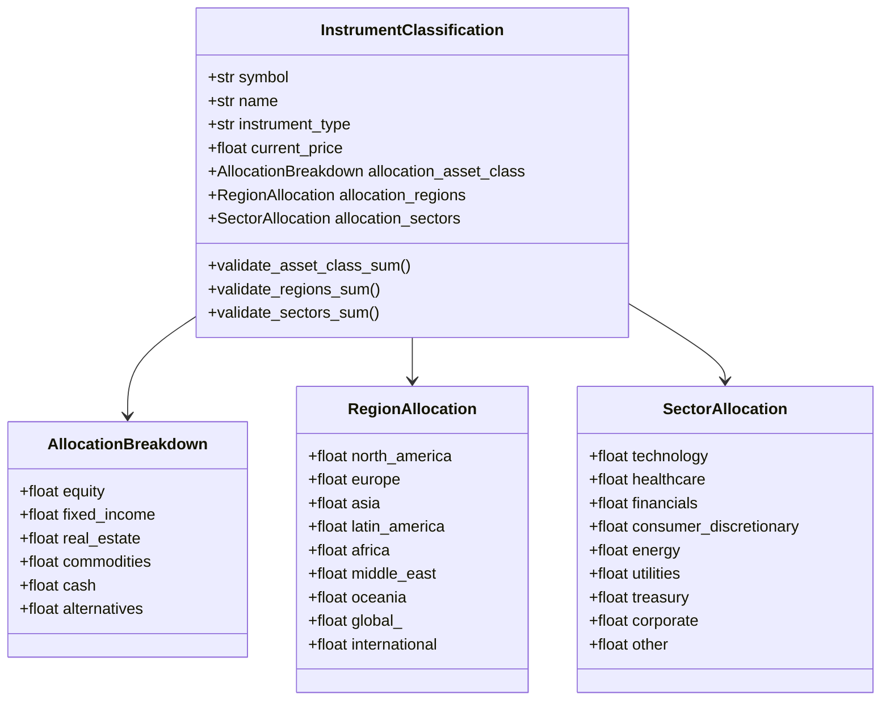
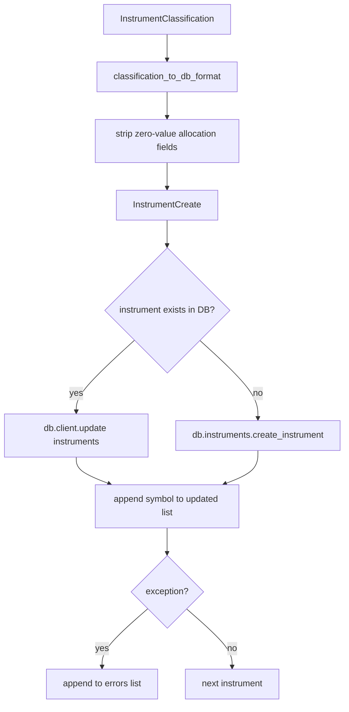

# Tagger Agent Explainer

The Tagger is a **classification specialist** in the Alex pipeline. Its sole job is to take a list of financial instrument symbols (ETFs, stocks, mutual funds) and enrich them with structured metadata — instrument type, current price, and three allocation breakdowns (asset class, region, sector) — then persist that data to Supabase.

It is invoked by the Planner before downstream agents (Reporter, Charter, Retirement) run, ensuring every instrument in the portfolio is classified before analysis begins.

---

## What it does

1. Receives a list of instrument dicts (`symbol`, `name`, optional `instrument_type`) via a direct Lambda invocation
2. Sends each instrument to the LLM (Bedrock via LiteLLM) asking for a structured `InstrumentClassification`
3. Validates that each of the three allocation categories sums to 100%
4. Upserts the result into the `instruments` table in Supabase

---

## System position



---

## Lambda entry point

[lambda_handler.py](../../backend/tagger/lambda_handler.py) is invoked directly by the Planner (not via SQS). It expects the event shape:

```json
{
  "instruments": [
    { "symbol": "VTI", "name": "Vanguard Total Stock Market ETF" }
  ]
}
```



The `observe()` context manager wraps the entire execution. If `LANGFUSE_SECRET_KEY` is set, it configures logfire + LangFuse and flushes traces on exit (including a 10-second wait to survive Lambda's rapid shutdown).

---

## Classification flow

The core logic lives in [agent.py](../../backend/tagger/agent.py). `tag_instruments` iterates over the list, calling `classify_instrument` for each one sequentially (with a 0.5-second delay between calls to avoid rate limits).



`classify_instrument` builds the prompt, creates a single-turn `Agent` with no tools (structured output only), and calls `Runner.run` with `max_turns=5`. It extracts the result with `result.final_output_as(InstrumentClassification)`.

---

## Structured output model

The LLM must return a fully validated `InstrumentClassification` Pydantic object. Three nested models carry the allocation data, each with its own `@field_validator` that enforces the 100% sum rule (±3% tolerance for floating-point rounding).



All three allocation models use `extra="forbid"` so unexpected fields from the LLM are rejected immediately.

---

## Database upsert logic

After classification, `process_instruments` in [lambda_handler.py](../../backend/tagger/lambda_handler.py) checks whether each symbol already exists in Supabase. If it does, it updates the row; if not, it creates a new one via `db.instruments.create_instrument`.



`classification_to_db_format` in [agent.py](../../backend/tagger/agent.py) converts the nested Pydantic models into plain dicts and strips zero-value keys before writing to the database — keeping rows lean.

---

## Retry strategy

Rate limit handling uses `tenacity`:

| Parameter       | Value                        |
| --------------- | ---------------------------- |
| Retry condition | `RateLimitError` only        |
| Max attempts    | 5                            |
| Backoff         | Exponential, 4s min, 60s max |
| On each sleep   | Log the wait time            |

Non-rate-limit errors propagate immediately and are caught by the per-instrument try/except in `tag_instruments`, which logs the failure and appends `None` (later filtered out).

---

## Prompt design

The agent uses two templates from [templates.py](../../backend/tagger/templates.py):

**`TAGGER_INSTRUCTIONS`** (system prompt) — establishes the role as a financial instrument classifier, explains the three allocation categories, requires each to sum to 100%, and gives concrete examples (SPY, BND, AAPL, VTI, VXUS).

**`CLASSIFICATION_PROMPT`** (user turn) — fills in `{symbol}`, `{name}`, and `{instrument_type}`, then explicitly lists every valid field name in each allocation category so the LLM knows the exact schema.

The agent has `tools=[]` — no tool calls, pure structured output. This is intentional: the OpenAI Agents SDK via LiteLLM+Bedrock does not support both structured outputs and tool calling simultaneously.

---

## Key dependencies

| Package                  | Role                                                 |
| ------------------------ | ---------------------------------------------------- |
| `openai-agents[litellm]` | Agent runner + LiteLLM Bedrock bridge                |
| `pydantic`               | Structured output validation                         |
| `tenacity`               | Retry with exponential backoff                       |
| `alex-database`          | Shared Supabase database client (editable local dep) |
| `langfuse` + `logfire`   | Optional trace export                                |

Model is configured via environment variables:

| Env var            | Default                                                        |
| ------------------ | -------------------------------------------------------------- |
| `BEDROCK_MODEL_ID` | `us.anthropic.claude-3-7-sonnet-20250219-v1:0`                 |
| `BEDROCK_REGION`   | `us-west-2`                                                    |
| `AWS_REGION_NAME`  | Set at runtime to match `BEDROCK_REGION` (required by LiteLLM) |

---

## Testing

[test_simple.py](../../backend/tagger/test_simple.py) invokes `lambda_handler` directly with a single instrument (VTI) and prints the classification result. Run it with:

```bash
uv run test_simple.py
```

No mock flag is needed — the tagger always calls Bedrock directly; there is no mock mode.
