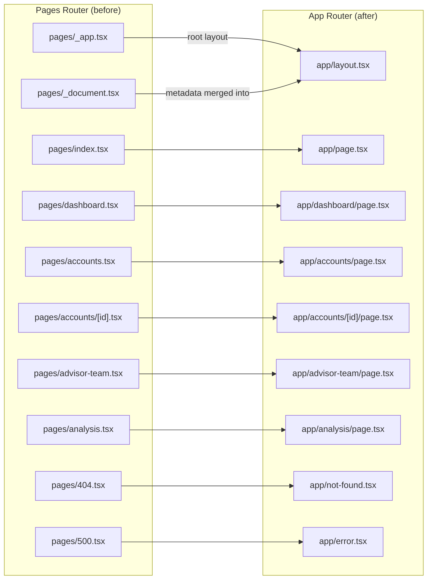
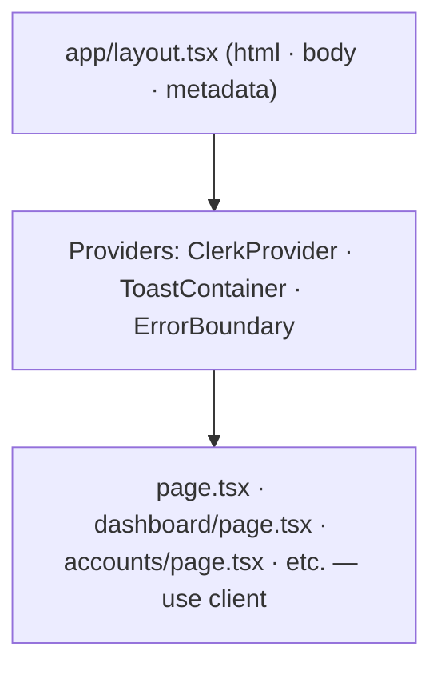

# App Router Migration Plan

## Context

The frontend currently uses Next.js Pages Router. The original reason ("required by Clerk") is no longer valid — Clerk v6 (currently installed at `^6.32.0`) fully supports App Router. This migration modernises the codebase and aligns with current Next.js conventions, while keeping the `output: 'export'` static build for S3/CloudFront deployment unchanged.

**Critical constraint**: `next.config.ts` has `output: 'export'`. This means no Node.js server at runtime, so:

- Clerk middleware cannot be used for server-side auth protection (same as today — auth is client-side via `Protect` and hooks)
- All pages stay as client components (`'use client'`) since they use hooks and browser state
- No API routes are needed (backend is a separate FastAPI service on Lambda)

---

## File Mapping



| Pages Router              | App Router                     |
| ------------------------- | ------------------------------ |
| `pages/_app.tsx`          | `app/layout.tsx` (root layout) |
| `pages/_document.tsx`     | metadata in `app/layout.tsx`   |
| `pages/index.tsx`         | `app/page.tsx`                 |
| `pages/dashboard.tsx`     | `app/dashboard/page.tsx`       |
| `pages/accounts.tsx`      | `app/accounts/page.tsx`        |
| `pages/accounts/[id].tsx` | `app/accounts/[id]/page.tsx`   |
| `pages/advisor-team.tsx`  | `app/advisor-team/page.tsx`    |
| `pages/analysis.tsx`      | `app/analysis/page.tsx`        |
| `pages/404.tsx`           | `app/not-found.tsx`            |
| `pages/500.tsx`           | `app/error.tsx`                |

---

## Steps

### Component hierarchy



### 1. Create `app/layout.tsx`

Replaces both `_app.tsx` and `_document.tsx`. Contains:

- `<html lang="en">` and `<body>` wrapper
- Favicon/manifest `<link>` tags and meta description (previously in `_document.tsx`)
- `ClerkProvider` (previously in `_app.tsx`)
- `ToastContainer`
- `ErrorBoundary`
- Import of `globals.css`
- Export `metadata` object for Next.js App Router SEO

Use a nested `Providers` client component to wrap `ClerkProvider` + `ToastContainer` (ClerkProvider requires client context); `layout.tsx` itself renders `<html>/<body>` and imports `Providers`.

### 2. Migrate each page — add `'use client'`

Every page uses Clerk hooks (`useUser`, `useAuth`) and React state, so each becomes a client component. The logic inside each file is **unchanged** — just:

- Add `'use client'` at the top
- Update `import { useRouter } from 'next/router'` → `import { useRouter } from 'next/navigation'`
- Update dynamic route access: `router.query.id` → `useParams()` from `next/navigation` (affects `accounts/[id].tsx`)
- Update query param access: `router.query.job_id` → `useSearchParams()` (affects `analysis.tsx`)
- Update `router.asPath` references if any → `usePathname()`

Files to migrate:

- `app/page.tsx` — from `pages/index.tsx`
- `app/dashboard/page.tsx` — from `pages/dashboard.tsx`
- `app/accounts/page.tsx` — from `pages/accounts.tsx`
- `app/accounts/[id]/page.tsx` — from `pages/accounts/[id].tsx`
- `app/advisor-team/page.tsx` — from `pages/advisor-team.tsx`
- `app/analysis/page.tsx` — from `pages/analysis.tsx`

### 3. Add `app/not-found.tsx`

Copy from `pages/404.tsx`. In App Router, `not-found.tsx` is the built-in 404 handler. No `'use client'` needed (static content only).

### 4. Add `app/error.tsx`

Copy from `pages/500.tsx`. In App Router, `error.tsx` is the built-in error boundary per-segment. Requires `'use client'` (App Router requirement).

### 5. Fix `PageTransition.tsx`

Currently uses Pages Router events (`router.events.on('routeChangeStart', ...)`), which don't exist in App Router. Replace with `usePathname`:

```tsx
'use client';
import { usePathname } from 'next/navigation';
import { useEffect, useState } from 'react';

export default function PageTransition({ children }) {
  const pathname = usePathname();
  const [opacity, setOpacity] = useState(1);

  useEffect(() => {
    setOpacity(0);
    const t = setTimeout(() => setOpacity(1), 150);
    return () => clearTimeout(t);
  }, [pathname]);

  return (
    <div style={{ opacity, transition: 'opacity 0.15s ease' }}>{children}</div>
  );
}
```

### 6. `lib/config.ts`

No changes required. The `getApiUrl()` function checks `window.location.hostname` only when called — it is not invoked at module load time, so it is safe in static export.

### 7. `next.config.ts`

No changes required — `output: 'export'`, `reactStrictMode: true`, and `images.unoptimized: true` are all valid for App Router.

### 8. Delete Pages Router files

Once the `app/` directory is working, delete the `pages/` directory entirely.

---

## Files Changed

| File                                     | Action                                        |
| ---------------------------------------- | --------------------------------------------- |
| `frontend/app/layout.tsx`                | Create (new root layout)                      |
| `frontend/app/page.tsx`                  | Create from `pages/index.tsx`                 |
| `frontend/app/dashboard/page.tsx`        | Create from `pages/dashboard.tsx`             |
| `frontend/app/accounts/page.tsx`         | Create from `pages/accounts.tsx`              |
| `frontend/app/accounts/[id]/page.tsx`    | Create from `pages/accounts/[id].tsx`         |
| `frontend/app/advisor-team/page.tsx`     | Create from `pages/advisor-team.tsx`          |
| `frontend/app/analysis/page.tsx`         | Create from `pages/analysis.tsx`              |
| `frontend/app/not-found.tsx`             | Create from `pages/404.tsx`                   |
| `frontend/app/error.tsx`                 | Create from `pages/500.tsx`                   |
| `frontend/components/PageTransition.tsx` | Edit — replace router.events with usePathname |
| `frontend/pages/`                        | Delete entire directory when done             |

---

## Verification

1. `npm run build` — static export must succeed with no errors
2. `npm run dev` — dev server starts cleanly
3. Navigate to `/` — landing page loads, Clerk sign-in/sign-up works
4. Sign in — redirected to `/dashboard`, user data loads
5. Navigate to `/accounts` — accounts list loads
6. Navigate to `/accounts/[id]` — positions load for a specific account
7. Navigate to `/advisor-team` — trigger an analysis, polling works
8. Navigate to `/analysis` — report, charts, and retirement tabs all render
9. Visit a non-existent route — custom 404 displays
10. Check `out/` (static export output) — all routes generate as `.html` files
