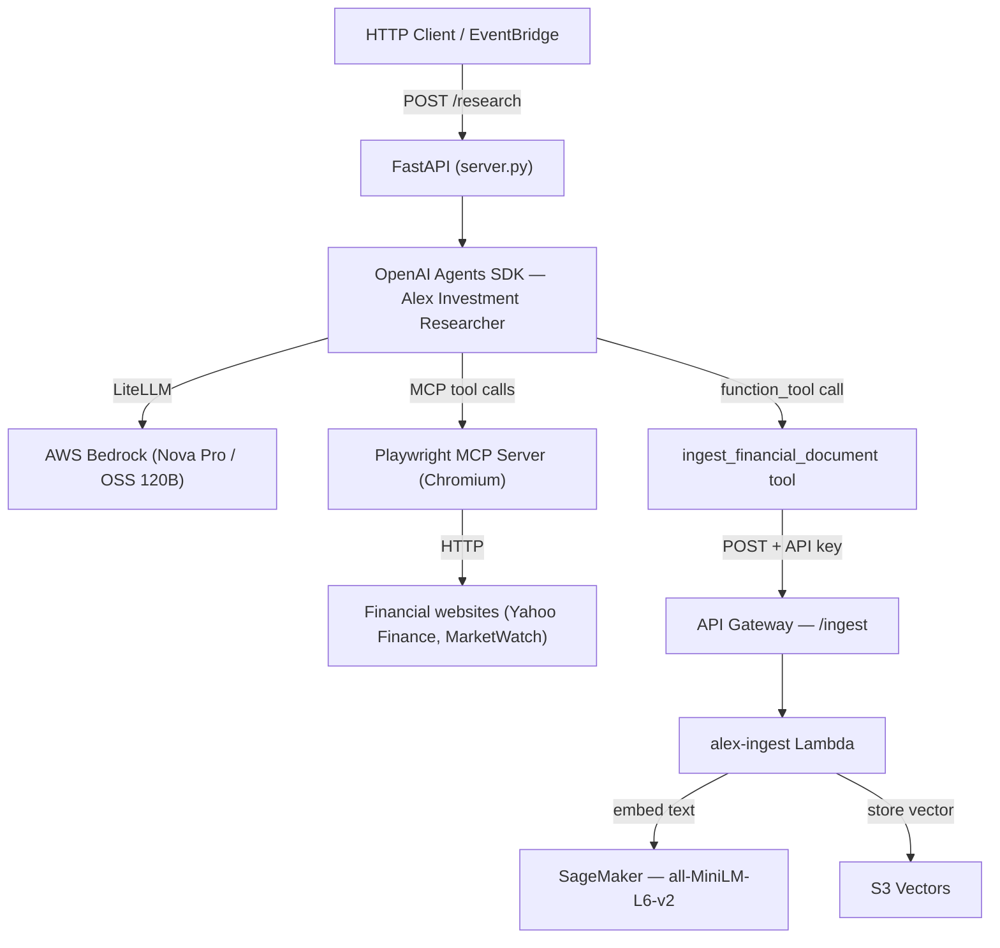
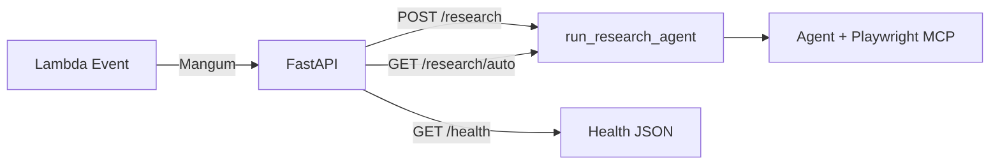
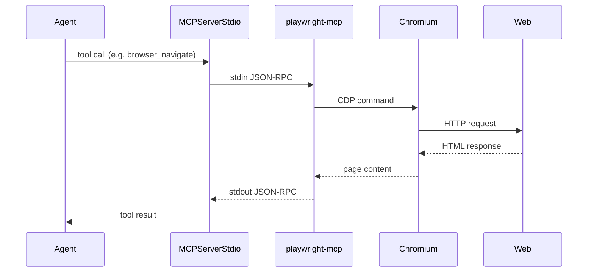
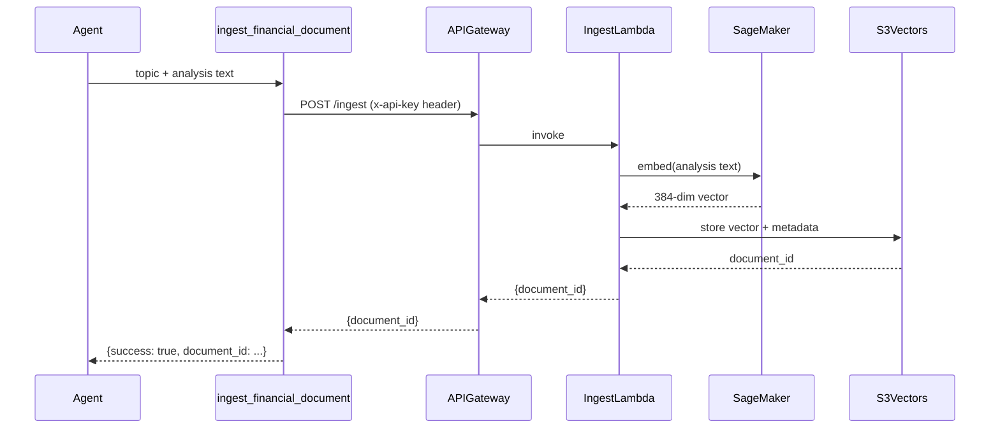
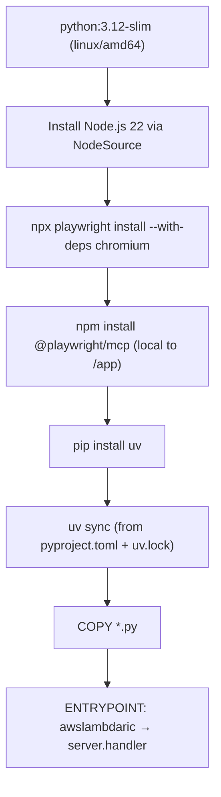
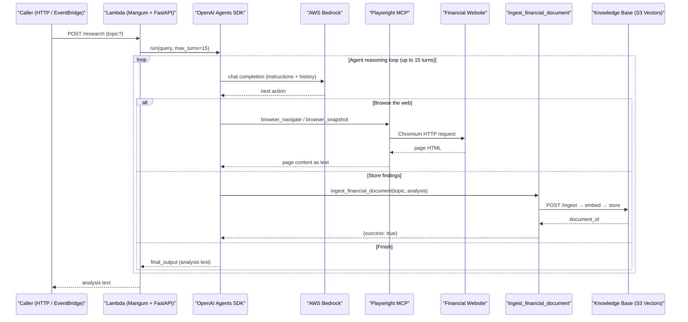

# Alex Researcher — Deep Dive

The researcher is an autonomous AI agent that browses the web for financial news, writes a structured analysis, and stores it in the Alex knowledge base — all without human input. It runs as an AWS Lambda container and is triggered either manually via HTTP or automatically on a schedule.

---

## Architecture



---

## File-by-file Breakdown

### `server.py` — FastAPI Application and Lambda Entry Point

This is the top-level file. It serves three roles:

1. **FastAPI app** — defines the HTTP API endpoints
2. **Agent runner** — creates and runs the OpenAI Agents SDK agent
3. **Lambda handler** — `Mangum` adapts the ASGI app to the Lambda event format



**Key design decisions:**

- **Why LiteLLM?** The OpenAI Agents SDK speaks the OpenAI API format. AWS Bedrock does not. `LitellmModel` is a translation layer that converts the SDK's OpenAI-format requests into Bedrock API calls — without it you'd need to write a custom Bedrock adapter for the SDK. The model string `bedrock/<model-id>` tells LiteLLM which provider and model to route to.
- **Mangum** wraps FastAPI so the same code runs locally (`uvicorn`) and in Lambda (event/context). No separate Lambda handler file needed.
- **Region env vars** are set at runtime inside `run_research_agent` rather than at module load. This is required because LiteLLM reads `AWS_REGION_NAME` (not the standard `AWS_REGION`) and the Lambda execution environment may not have it pre-set.
- **`RESEARCHER_MODEL`** is read from the environment variable injected by Terraform, defaulting to `bedrock/us.amazon.nova-pro-v1:0`. This avoids hardcoding.

**Endpoints:**

| Method | Path             | Purpose                                           |
| ------ | ---------------- | ------------------------------------------------- |
| GET    | `/`              | Minimal health check                              |
| GET    | `/health`        | Detailed health — shows model, region, API config |
| GET    | `/test-bedrock`  | Smoke-tests the Bedrock connection directly       |
| POST   | `/research`      | Manual research — accepts optional `topic`        |
| GET    | `/research/auto` | Automated research — agent picks the topic        |

The `/research/auto` endpoint exists specifically for the EventBridge scheduler. It always lets the agent choose its own topic and returns a structured JSON response rather than raw text, so the scheduler Lambda can log outcome cleanly.

---

### `context.py` — Agent Instructions and Default Prompt

Contains two things:

- **`get_agent_instructions()`** — the system prompt injected into the agent. Injects today's date dynamically so the agent knows what "current" means.
- **`DEFAULT_RESEARCH_PROMPT`** — the user message sent when no topic is provided.

The instructions enforce a strict three-step process to keep the agent from over-browsing (a known failure mode for financial research agents that leads to timeouts):

```text
Step 1: Browse — max 2 pages (Yahoo Finance or MarketWatch)
Step 2: Analyse — 3–5 bullet points, one recommendation
Step 3: Save — call ingest_financial_document immediately
```

**IMPORTANT:** The constraint of 2 pages maximum is intentional — unconstrained browsing agents will follow links indefinitely and exhaust the Lambda timeout.

---

### `mcp_servers.py` — Playwright MCP Server

Playwright runs as a subprocess via the [Model Context Protocol](https://modelcontextprotocol.io/) stdio transport. The agent issues browser actions as MCP tool calls; Playwright executes them in a headless Chromium instance and returns the page content.



**Why absolute binary path?**
Lambda's `PATH` is minimal and does not include `/app/node_modules/.bin/`. The binary is referenced by its full path `/app/node_modules/.bin/playwright-mcp` to ensure it is found regardless of the execution environment.

**Why detect container environment?**
Playwright's bundled Chromium lives at `/root/.cache/ms-playwright/chromium-*/chrome-linux*/chrome` inside the Docker image. The `--executable-path` flag is only added when running inside a container or Lambda (`AWS_EXECUTION_ENV` is set) — locally it uses the system-installed browser.

**Playwright flags used:**

| Flag                    | Reason                                                       |
| ----------------------- | ------------------------------------------------------------ |
| `--headless`            | No display available in Lambda                               |
| `--isolated`            | Each invocation gets a fresh browser context                 |
| `--no-sandbox`          | Required in container environments without kernel namespaces |
| `--ignore-https-errors` | Handles financial sites with cert edge cases                 |
| `--user-agent`          | Avoids bot-detection blocks on financial news sites          |

---

### `tools.py` — Agent Tool: `ingest_financial_document`

The agent has one tool it can call: `ingest_financial_document`. When the agent is satisfied with its analysis, it calls this tool to persist the result.



**Retry logic:** The tool wraps the HTTP call with `tenacity` — 3 attempts with exponential backoff (1s → 10s). This handles SageMaker cold starts, which can delay the first embedding request by 10–30 seconds after the endpoint has been idle.

**Graceful degradation:** If `ALEX_API_ENDPOINT` or `ALEX_API_KEY` are not set (e.g. running locally without a `.env`), the tool returns `{success: false, error: "Running in local mode"}` instead of raising. The agent continues and returns its analysis as output even if storage fails.

---

### `Dockerfile` — Container Image

The researcher runs as a Lambda container image. The image bundles Python, Node.js, Chromium, and the Playwright MCP binary together.



**Important notes:**

- Built for `linux/amd64` — Lambda runs on x86_64 regardless of your local machine architecture (Apple Silicon, etc.)
- `@playwright/mcp` is installed locally to `/app/node_modules/` rather than globally, so the binary is at a deterministic, absolute path (`/app/node_modules/.bin/playwright-mcp`)
- `awslambdaric` is the Lambda Runtime Interface Client — it handles the Lambda bootstrap protocol so the FastAPI app receives Lambda events correctly via Mangum
- The `.venv` Python from `uv sync` is invoked directly (`/app/.venv/bin/python`) to avoid uv writing to the filesystem at invocation time

---

## Request Lifecycle



---

## Environment Variables

These are set by Terraform when deploying (see `terraform/4_researcher/terraform.tfvars`):

| Variable            | Description                            | Example                                  |
| ------------------- | -------------------------------------- | ---------------------------------------- |
| `RESEARCHER_MODEL`  | LiteLLM model string for Bedrock       | `bedrock/us.amazon.nova-pro-v1:0`        |
| `BEDROCK_REGION`    | AWS region for Bedrock inference       | `us-west-2`                              |
| `ALEX_API_ENDPOINT` | Ingest API Gateway URL from Guide 3    | `https://xxx.execute-api.../prod/ingest` |
| `ALEX_API_KEY`      | API key for the ingest endpoint        | (from API Gateway)                       |
| `OPENAI_API_KEY`    | Required by OpenAI Agents SDK tracing  | (from OpenAI platform)                   |
| `MCP_LOGGING`       | Set to `True` to enable MCP debug logs | `False`                                  |

**Note on region env vars:** LiteLLM requires `AWS_REGION_NAME` specifically (not `AWS_REGION` or `AWS_DEFAULT_REGION`). `server.py` sets all three at runtime to avoid issues across different AWS SDK versions.

---

## Model Requirements

The researcher uses tool calling (Playwright MCP) and therefore **requires a model that supports tool use**. Not all Bedrock models do:

| Model                            | Tool calling | Notes                                                       |
| -------------------------------- | ------------ | ----------------------------------------------------------- |
| `us.amazon.nova-pro-v1:0`        | Yes          | Recommended — inference profile for cross-region resilience |
| `amazon.nova-pro-v1:0`           | Yes          | Single-region only                                          |
| `global.openai.gpt-oss-120b-1:0` | No           | LiteLLM drops `tools` param — agent cannot browse           |
| `amazon.nova-lite-v1:0`          | No           | Insufficient capability for tool use in this context        |

---

## Local Development

```bash
cd backend/researcher
cp ../../.env .env          # copy root env vars
uv run server.py            # starts uvicorn on port 8000
```

Then test with:

```bash
curl http://localhost:8000/health
curl -X POST http://localhost:8000/research -H "Content-Type: application/json" -d '{"topic": "NVDA earnings"}'
```

The `test_local.py` script runs the agent in local mode (no Lambda, no Docker).

---

## Deployment

```bash
cd backend/researcher
uv run deploy.py
```

`deploy.py` does the following:

1. Gets the ECR repository URL from `terraform output`
2. Logs Podman into ECR
3. Builds the image for `linux/amd64`
4. Tags and pushes to ECR with a timestamped tag and `latest`
5. Updates the Lambda function to use the new image URI
6. Polls until the Lambda update is `Successful`
7. Prints the Function URL

After the first deploy, set `researcher_image_uri` in `terraform/4_researcher/terraform.tfvars` and run `terraform apply` to create the Lambda function itself. Subsequent deploys update the existing function directly.
