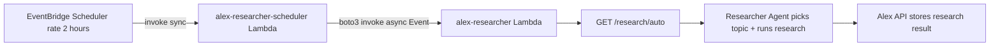
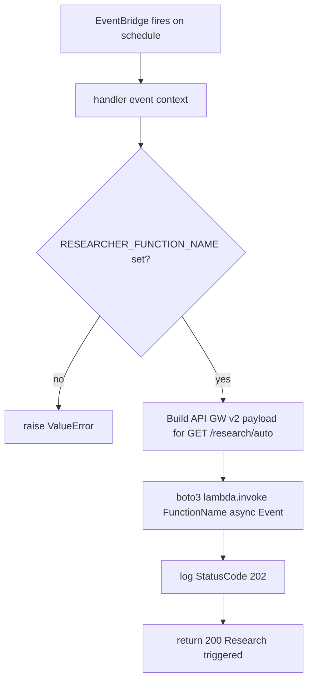
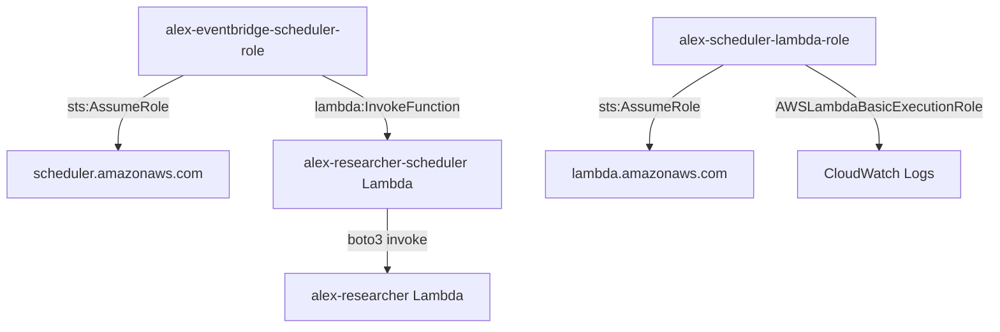

# Scheduler Explainer

The Scheduler is a **minimal trigger Lambda** — its sole job is to fire the Researcher Lambda on a fixed schedule so that market research is continuously refreshed without any user interaction. It is not an AI agent itself; it is a lightweight orchestration shim between AWS EventBridge Scheduler and the Researcher Lambda.

---

## What it does

1. Wakes up every **2 hours**, triggered by an EventBridge Scheduler rule
2. Constructs a Lambda Function URL-compatible payload targeting the `/research/auto` route
3. Asynchronously invokes the Researcher Lambda (`InvocationType="Event"` — fire-and-forget)
4. Returns immediately; the Researcher runs independently and persists its own results

---

## Architecture overview



---

## Invocation flow



---

## Payload structure

The scheduler builds a payload that mirrors what AWS generates for a Lambda Function URL request (API Gateway HTTP API v2 format). This lets the Researcher Lambda's FastAPI routing dispatch the call to the correct handler without any special-casing:

```json
{
  "version": "2.0",
  "routeKey": "$default",
  "rawPath": "/research/auto",
  "rawQueryString": "",
  "headers": { "content-type": "application/json" },
  "requestContext": {
    "http": {
      "method": "GET",
      "path": "/research/auto"
    }
  },
  "isBase64Encoded": false
}
```

`InvocationType="Event"` means the scheduler Lambda does not wait for the Researcher to finish — it receives HTTP 202 and exits.

---

## IAM and permissions model



The scheduler Lambda's IAM role (`alex-scheduler-lambda-role`) has `AWSLambdaBasicExecutionRole` for CloudWatch Logs and an inline `InvokeResearcherPolicy` granting `lambda:InvokeFunction` on the researcher Lambda ARN.

---

## Conditional deployment

The scheduler and its associated IAM roles and EventBridge rule are only created when **both** conditions are true in Terraform:

```hcl
locals {
  researcher_deployed = var.researcher_image_uri != ""
  scheduler_active    = var.scheduler_enabled && local.researcher_deployed
}
```

| Variable | Default | Meaning |
| -------- | ------- | ------- |
| `scheduler_enabled` | `false` | Must be explicitly set to `true` in `terraform.tfvars` |
| `researcher_image_uri` | `""` | Must be populated after `deploy.py` pushes the container image |

All resources guarded by `count = local.scheduler_active ? 1 : 0` are skipped until both flags are satisfied.

---

## Key files

| File | Role |
| ---- | ---- |
| [lambda_function.py](backend/scheduler/lambda_function.py) | Entire scheduler implementation — 40 lines |
| [pyproject.toml](backend/scheduler/pyproject.toml) | No runtime dependencies; pure `boto3` (provided by Lambda runtime) |
| [terraform/4_researcher/main.tf](terraform/4_researcher/main.tf) | Defines `aws_scheduler_schedule`, both IAM roles, and the scheduler Lambda alongside the researcher |

---

## Environment variables

| Variable | Set by | Purpose |
| -------- | ------ | ------- |
| `RESEARCHER_FUNCTION_NAME` | _expected by code_ | Name or ARN of the researcher Lambda to invoke |

Terraform sets this to `aws_lambda_function.researcher[0].function_name` (`alex-researcher`).

---

## Design decisions

- **Fire-and-forget (`InvocationType="Event"`)** — research jobs can take several minutes. Using async invocation lets the scheduler Lambda exit immediately (well within EventBridge's 30-second invocation timeout) and avoids tying up a Lambda execution context waiting for the result.
- **Lambda Function URL payload format** — rather than writing a custom dispatcher, the scheduler reuses the exact payload shape that AWS generates for Function URL calls. The Researcher's FastAPI app (via Mangum) already knows how to unpack this format, so no changes were needed on the Researcher side.
- **No dependencies** — `boto3` is included in the Lambda Python runtime. The `pyproject.toml` declares zero additional packages, keeping the deployment artifact (`lambda_function.zip`) tiny.
- **Co-located Terraform** — the scheduler is defined in `terraform/4_researcher/` alongside the Researcher, since it has no meaning without the Researcher being deployed first. This enforces the correct provisioning order.
